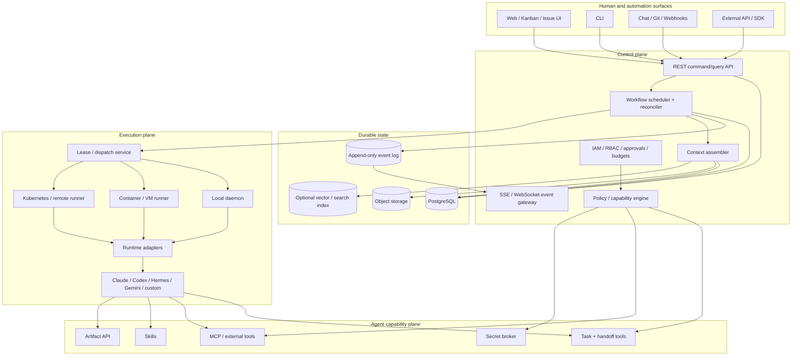
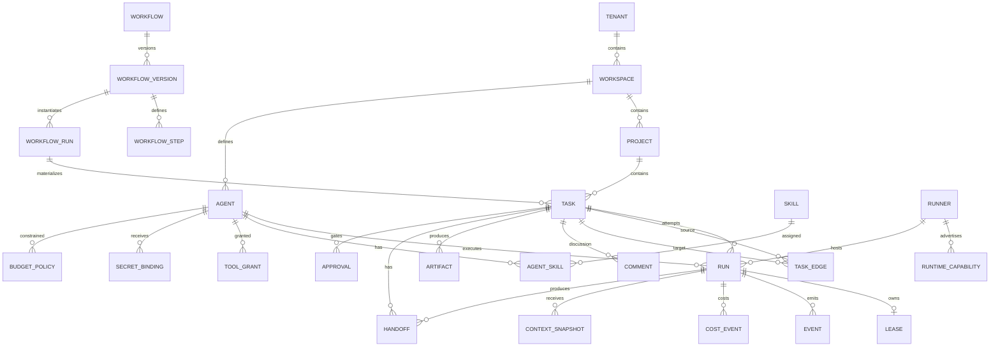
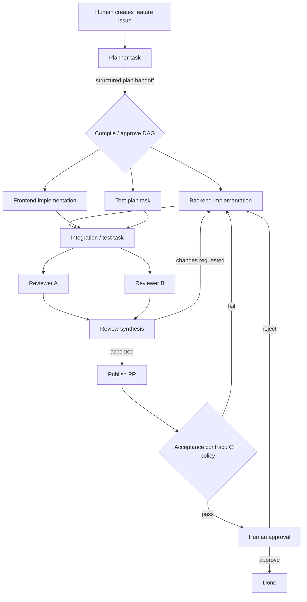

# Technical Comparative Report: Multica, Gas City, Hermes Kanban, and Paperclip — and a Fused Architecture for Durable Multi-Agent Work

## Executive summary

The four systems solve overlapping parts of the same emerging problem—**turning transient AI-agent executions into durable, observable, coordinated work**—but they start from four different abstractions.

**Multica** starts from the **human/agent issue tracker**. An issue is the durable collaboration object; assignment, mentions, chat, and automation create runs; a local daemon executes the selected coding-agent CLI; progress, comments, transcripts, branches, and review state flow back into the issue. Its strongest ideas are the human-facing work model, broad provider compatibility, local execution boundary, project resources, reusable skills, worktree continuity, and squad-based delegation. citeturn11view0turn11view1turn9view0

**Gas City** starts from the **software-factory work graph**. Work is persisted as Beads; reusable workflows are formulas materialized into dependency graphs; agents are declaratively configured sessions; routing is explicit; orders add event/cron/condition triggers; a supervisory controller continuously reconciles desired and actual runtime state. Its strongest ideas are “state outside the model,” declarative workflow composition, explicit dependency graphs, provider-neutral runtime infrastructure, append-only events, and Erlang-style supervision. citeturn5view0turn9view1turn16view0turn15view6

**Hermes Kanban** starts from the **durable agent work queue**. Tasks, dependencies, comments, attempts, structured handoffs, reviews, and events are stored in SQLite; a dispatcher atomically claims ready cards and spawns full Hermes profile processes. Workers get a deliberately small `kanban_*` tool surface and reconstruct their working context from durable board state rather than relying on a parent agent's context window. Its strongest ideas are the exceptionally clean task/run distinction, explicit worker protocol, structured run handoffs, dependency gating, crash reclaim, review loops, task-scoped tools, and simple per-board isolation. citeturn9view2turn10view0turn10view5

**Paperclip** starts from the **organizational control plane**. Agents are employees in an org graph with roles, goals, reporting lines, permissions, budgets, workspaces, approvals, secrets and audit history. Heartbeat executions invoke adapters, agents interact with the control plane through HTTP, and persistent session state can survive heartbeat boundaries. Its strongest contributions to a fused engineering system are governance, atomic checkout, goal ancestry, budgets/cost attribution, short-lived execution identities, secret management, multi-organization isolation, plugins, and durable auditability. citeturn19view0turn18view2turn19view1turn19view2

The best architecture is therefore **not to pick one of the four orchestration models**. It is to layer them:

1. Use **Multica's issue/project experience as the human-facing surface**.
2. Make the underlying work representation a **Gas City–style durable DAG**, so dependencies and workflow progression are deterministic rather than hidden in conversational prompts.
3. Give workers a **Hermes-style minimal task protocol** with first-class attempts, leases, structured handoffs, heartbeats, reviews, comments and artifacts.
4. Execute through **Multica-style local runners plus Paperclip-style adapters**, allowing CLI, HTTP, container, ACP/MCP, Kubernetes and remote execution.
5. Add **Paperclip-style governance** around identities, secrets, budgets, approvals and audit.
6. Treat LLM context as a **derived cache of durable state**, never as the system of record. Gas City's Beads and Hermes's task/run model demonstrate the fundamental architectural principle: an agent process should be disposable while its work survives. citeturn5view0turn10view5turn18view0

The central object model I recommend is:

> **Workspace → Project → Task graph → Task → Run/Attempt → Handoff/Artifact/Event**

with **Agent**, **Runner**, **Workflow**, **Skill**, **Tool Grant**, **Approval**, **Budget**, and **Secret Reference** as orthogonal control-plane entities.

The main orchestration rule should be:

> **Models decide what to do inside a task; the control plane decides when a task may run, who may run it, what context and capabilities it receives, whether its result is accepted, and what becomes runnable next.**

That separation preserves agent flexibility without outsourcing workflow correctness to probabilistic reasoning.

A second important conclusion is that there is no credible apples-to-apples performance benchmark in the primary project material reviewed. I therefore do **not** assign synthetic numerical “architecture scores” or throughput rankings. The useful quantitative numbers in the projects—Multica's daemon concurrency, Hermes's dispatcher intervals, Gas City's patrol interval, etc.—measure different layers and would make a misleading chart if plotted as comparable performance metrics. citeturn11view2turn10view3turn15view6

## Comparative architecture and workflow model

A useful distinction is between **work ingress** and **behavioral prompt construction**. “How does the system accept a prompt?” actually means two different things:

*How does a user express work?* Multica accepts issues/comments/chat/automation; Gas City accepts beads and formula dispatch; Hermes accepts cards through tools/CLI/dashboard; Paperclip accepts issues and wakeups. *How is an agent instructed when execution begins?* Multica combines agent instructions, skills and issue/project context; Gas City renders a role template at session startup and expects the agent to query durable work; Hermes injects a worker protocol and makes the worker call `kanban_show`; Paperclip passes a prompt template/instructions bundle while the agent subsequently interacts with its REST control plane. citeturn11view1turn14view0turn10view0turn18view2turn18view4

| Dimension | Multica | Gas City | Hermes Kanban | Paperclip |
|---|---|---|---|---|
| Primary abstraction | Human/agent **issue** | Durable **Bead graph / software factory** | Durable **Kanban task queue** | **Company / organizational control plane** |
| Work ingress | Issue assignment, `@mention`, direct chat, Autopilot citeturn12view0 | `gc sling`, Beads, formulas, orders/cron/events citeturn15view3turn16view2 | CLI, dashboard, slash command, `kanban_create`; triage decomposition citeturn10view3turn9view2 | UI/API issue assignment, timer, assignment, on-demand and automation wakeups citeturn18view3 |
| Durable work state | PostgreSQL issues/runs/comments | Bead store plus append-only events | Per-board SQLite | PostgreSQL/PGlite control plane |
| Execution | Local Multica daemon → coding-agent CLI | Runtime provider → persistent/reconciled session | Dispatcher → full Hermes profile OS process | Heartbeat → adapter → CLI/process/HTTP agent |
| Behavioral prompt | Agent instructions + skills + task/project context | Markdown Go template + deployment `PromptContext` | Profile prompt + injected `KANBAN_GUIDANCE` | `promptTemplate` / managed instruction bundle |
| Workflow topology | Primarily issue- and squad-oriented | Explicit formulas → molecule/bead DAG | Explicit parent-child dependency DAG | Parent tasks + blocker relations; intentionally not a workflow builder |
| Dependency enforcement | Issue/squad coordination is central in reviewed core docs | `needs` relationships in formula/bead graph | Parent must finish before child promotion/completion | First-class blocker relationships + parent hierarchy |
| Handoff primitive | Issue comment, reassignment, same-issue follow-up, review state | Bead close/routing, mail bead, molecule progression | Run `summary` + `metadata`, comments, review transitions | Comments, child issues, artifacts/work products, assignment/events |
| Context continuity | Issue history + project resources + continuing worktree/session when safe | Durable Bead/event state queried by disposable sessions | Full comment thread + parent handoffs + previous attempts + attachments | Goal ancestry + task/project state + skills + resumable adapter session |
| Human-in-loop | Strong issue/review UX | Operator CLI/dashboard/event model; policy configurable | Comment, block/unblock, review, dashboard | Strong approval/governance model |
| Failure model | Classified failures, automatic transient retry, resumable working directory/session | Persistent work + supervisor restart/reconcile + workflow retry policies | Lease/heartbeat, crash reclaim, retry counter/circuit breaker | Heartbeat run states, cancellation, orphan recovery, pause/budget controls |
| Security stance | Run is normally as powerful as daemon OS user | Depends strongly on runtime provider/site deployment | Explicitly trusted-local, single-host model | Auth, agent keys/run identities/secrets/governance, but local CLI adapters remain unsandboxed |
| Extensibility sweet spot | Providers, skills, MCP, integrations | Packs, formulas, orders, runtime/store providers | Hermes profiles and worker tools | Adapters, plugins, tools, routines |

Sources for the matrix are the projects' current first-party architecture and runtime documents. citeturn9view0turn11view0turn9view1turn9view2turn18view0turn18view1

Architecturally, they can be reduced to four shapes:

```mermaid
flowchart TB
    subgraph M["Multica — issue-centric"]
        MUI["Web / Desktop / Mobile / CLI"]
        MB["Go control plane"]
        MDB[("PostgreSQL")]
        MD["Local daemon"]
        MA["Claude / Codex / Cursor / ..."]
        MUI <--> MB
        MB <--> MDB
        MB <-- "WebSocket: runs + progress" --> MD
        MD --> MA
    end

    subgraph G["Gas City — graph-centric"]
        GC["city.toml + packs + formulas"]
        GO["Orchestrator / supervisor"]
        GB[("Bead store")]
        GE[("Append-only events")]
        GS["Sessions / runtime providers"]
        GC --> GO
        GO <--> GB
        GO <--> GE
        GO <--> GS
        GS --> GB
    end

    subgraph H["Hermes Kanban — queue-centric"]
        HU["CLI / Dashboard / Slash / Tools"]
        HDB[("Board SQLite")]
        HD["Dispatcher"]
        HW["Hermes profile workers"]
        HU <--> HDB
        HD <--> HDB
        HD --> HW
        HW <--> HDB
    end

    subgraph P["Paperclip — control-plane-centric"]
        PUI["React UI / API"]
        PS["Express control plane"]
        PDB[("PostgreSQL / PGlite")]
        PQ["Heartbeat / wake queue"]
        PA["Adapters"]
        PW["External agents"]
        PUI <--> PS
        PS <--> PDB
        PS --> PQ
        PQ --> PA
        PA --> PW
        PW -->|"REST task updates"| PS
    end
```



Multica's repository explicitly documents Next.js → Go/Chi/WebSocket → PostgreSQL with a local daemon executing coding CLIs. Gas City's architecture makes the Bead store, event bus, configuration, session providers and controller distinct layers. Hermes uses the board DB as the common consistency boundary for dashboard/CLI/agent tools. Paperclip documents React, Express, PostgreSQL/PGlite and adapters as its main layers. citeturn9view0turn9view1turn10view3turn18view1turn18view2

The most important differences for a new implementation are not UI features but **where correctness lives**:

| System | What the LLM is trusted to decide | What deterministic infrastructure decides |
|---|---|---|
| Multica | How to solve an issue; squad leader chooses delegation | Trigger/run lifecycle, runtime allocation, concurrency, workdir handling, retries and permissions citeturn11view2turn13view2 |
| Gas City | How a configured role handles a claimed Bead | Formula DAG, routing substrate, work persistence, event records, runtime reconciliation citeturn14view0turn16view2turn15view6 |
| Hermes | How to execute a card, what summary/evidence to leave | Dependency gating, claims, attempt ownership, stale reclaim, review state, circuit breaker citeturn10view0turn10view5 |
| Paperclip | Task-level reasoning/delegation within organizational rules | Atomic checkout, budgets, approvals, identity, secrets, company isolation and audit citeturn19view0turn19view1 |

That is why Gas City and Hermes provide the strongest orchestration substrate, while Multica and Paperclip provide the stronger product/control-plane layers.

## Multica technical anatomy

Multica's data model is deliberately collaboration-oriented. A **workspace** contains people, agents and configuration; an **issue** holds a goal, description, discussion, status and history; a **project** groups issues and binds execution resources; an **agent** is a reusable identity/configuration rather than a persistent process; a **runtime** is the machine/tool combination that can execute an agent; and a **run** is one concrete execution. Skills, squads and Autopilots layer reusable capability, multi-agent routing and automation on top. citeturn11view0

**Prompt and work ingress.** An agent run can be caused by assignment, a mention in an issue comment, a direct chat message, or an Autopilot. The issue itself contributes the work description and discussion; the assigned agent contributes instructions, model, skills and runtime configuration. Agent instructions are supplied on every run, while an agent description is explicitly display-only and does not enter the execution prompt. citeturn11view1turn12view0turn13view1

The execution path is straightforward:

```text
issue / comment / chat / autopilot
        ↓
    create Run
        ↓
 server-side queue
        ↓
 matching runtime daemon claims
        ↓
 local coding-agent CLI executes
        ↓
 tool events / comments / outcome stream back
        ↓
 original issue remains the collaboration record
```

The server/runner boundary is one of Multica's strongest architectural choices. The daemon discovers supported CLIs on `PATH`, registers corresponding runtimes, maintains a persistent connection, receives server notification for new runs and polls as a recovery path after connection interruption. It heartbeats every 15 seconds. The documented default machine-wide limit is 20 concurrent runs and the default per-agent limit is 6, with queueing after capacity is reached. citeturn11view2

Multica currently advertises 26 supported CLI/runtime integrations in its repository documentation, including Claude Code, Codex, Cursor Agent, GitHub Copilot CLI, OpenCode, OpenClaw, Hermes and Pi among many others. The crucial design choice is that Multica does not provide the model itself: it drives tools installed and authenticated on the runner machine. citeturn9view0

**Context propagation.** Project resources make context materially more structured than “paste a repo URL into the prompt.” A project can bind repositories or local directories. For each project run, Multica injects the project name, description and resource list and writes a machine-readable `.multica/project/resources.json`; workspace-linked repositories are also exposed. citeturn13view0

This becomes particularly strong for coding continuity. In worktree mode, each run gets an isolated Git worktree. Multica maintains an issue-oriented agent branch, records ownership/baseline metadata, preserves partial work, and allows subsequent runs on the same issue to continue from the previous delivered branch. It also attempts to replay the user's uncommitted/untracked local state into an isolated worktree rather than silently making the agent reason over a different source tree. Failed runs can preserve work rather than throw it away. citeturn13view0

That is a feature worth copying: **worktree identity should follow the logical task, not merely the process attempt**.

Skills are workspace-level packages based around `SKILL.md`, optionally with scripts, templates and reference material. Agent instructions encode identity/responsibilities and are always present; skills encode reusable methods and can be shared among multiple agents. Skills can be imported from local material, URLs or connected runtimes, and hosted imports can be refreshed while preserving agent bindings. citeturn12view3

**Coordination and handoff.** Multica's native collaboration model is conversational and issue-centric. Multiple runs can occur against one issue, and the same issue can be handed to different agents without replacing previous run records. A follow-up comment contributes new information to a later run. citeturn12view0turn13view1

Squads are a notable implementation of hierarchical multi-agent coordination. Assigning an issue to a squad initially wakes only its leader. Multica appends a system-managed operating protocol, roster and squad-specific instructions to the leader's prompt. The leader delegates by posting an issue comment containing exact `@mention` markup, which in turn triggers the selected agents. Member updates can wake the leader again; self-comments are guarded to avoid loops. The leader eventually moves the parent toward review rather than directly declaring the human-visible work done. citeturn13view2

This approach has a valuable UX property: **delegation is observable in the same issue thread humans already read**. But it is less formally deterministic than Gas City's or Hermes's graph model. In the core Multica documentation reviewed here, dependencies are not the fundamental scheduling primitive; the central concepts are issues, runs, comments, assignments, projects and squad routing. That makes Multica excellent for fluid collaboration, while a graph-based engine is a stronger base for reproducible multi-step factories. citeturn11view0turn13view2turn16view2turn9view2

**Failure and state semantics.** A run moves through states including deferred, queued, dispatched, local-directory wait, running, completed, failed and cancelled. Runtime disconnection does not immediately destroy queued work. Transient infrastructure failures—including runtime interruption, daemon restart, execution timeout or model-tool network interruption—can be retried automatically. The documented default is at most two executions for a regular run, while certain tool network interruptions receive up to three attempts. Provider authentication, quota, misconfiguration and similar non-transient errors normally require human correction and manual retry. citeturn12view0turn12view1

Multica also distinguishes logical task history from process continuity well. Manual retry can reuse the previous working directory and, when safe, the underlying agent session. Context overflow or other session-poisoning errors cause a clean model session while retaining the filesystem work. citeturn12view2

**Security.** The most consequential limitation is documented plainly: a local run normally has the full privileges of the OS user running the daemon. Multica does not claim a filesystem sandbox; coding tools are typically run unattended, and the default paths can use permissive tool modes. Multica therefore recommends putting the daemon under a dedicated user, container or VM and treating every credential visible to that environment as accessible to the agent. citeturn12view4

There are useful narrower controls. Runs receive run-scoped API tokens, per-run working directories and some per-run agent state; task environment variables include task/agent/workspace identifiers. But child processes can inherit the run token, so process boundaries alone are not capability boundaries. Custom environment and MCP configuration are stored server-side and delivered for execution, which is another reason a fused design should replace arbitrary environment-variable secrets with short-lived, capability-scoped secret references. citeturn11view2turn12view4

**Best ideas to retain:** human/agent issue parity, local daemon execution, huge CLI-provider surface, skills, project resources, task-oriented worktrees, streaming execution logs, run history, explicit human review, squads and external trigger channels. **Main weaknesses to correct in a new design:** no default hard sandbox, a relatively issue-centric rather than graph-first scheduler, and substantial semantics that vary by underlying coding CLI. citeturn9view0turn13view0turn12view4

## Gas City technical anatomy

Gas City is the most explicitly **orchestration-engineered** of the four. Its current conceptual model reduces the platform to six primitives: Agent, Bead, Formula, Rig, Pack and Event. An Agent says *who*; a Bead says *what*; a Formula says *how*; a Rig says *where*; a Pack configures reusable factory behavior; and Events expose what happened. The orchestrator and durable work store operate outside individual model sessions. citeturn5view0turn9view1

The project repository describes runtime providers including tmux, subprocess, exec, ACP, Kubernetes and herdr, with Beads-backed work tracking and a controller that reconciles desired session state with reality. Configuration, formulas, orders, prompt templates and packs are filesystem/configuration artifacts rather than hard-coded roles. citeturn3view1turn9view1

**Prompts are role definitions, not task payloads.** Gas City's prompt templates are Markdown files using Go `text/template`. A `PromptContext` provides values including city root, qualified agent name, rig, work directory, Git branch, default branch and, importantly, commands/queries for finding assigned and routable work. Shared partials and appended fragments compose reusable instructions. citeturn14view0

The key contrast with Multica is architectural: a Gas City prompt typically teaches an agent **how to discover and operate on durable work**, while the changing work itself lives in Beads. This keeps most mutable state out of the long-lived role prompt. The current implementation renders prompts once at agent startup; the documented limitations include a flat `map[string]string` context, no true template inheritance, and no runtime re-rendering without restarting the agent. citeturn14view0

This is a very good separation to copy:

```text
stable role prompt:
    "you are a reviewer; discover work using X; claim atomically;
     communicate using Y; finish by writing Z"

mutable work:
    durable task record + dependencies + metadata + artifacts

runtime context:
    rig, workspace, Git state, routing queries, identity
```

The prompt does not have to contain the whole factory state because the agent can ask the state store.

**Work graph.** Formula files are reusable workflow definitions. Gas City resolves formulas through layered pack/city/rig configuration, stages the selected formula definitions, and delegates materialization to the Beads backend. A runtime instance of a formula is a molecule; temporary formula runs are wisps. citeturn16view0

A formula can make dependencies explicit:

```toml
[[steps]]
id = "analyze"

[[steps]]
id = "test"
needs = ["analyze"]
```

The production `bd` backend performs detailed task materialization and dependency handling. Gas City's own runtime path then routes the molecule or its tasks to agents/pools rather than implementing a second independent in-process DAG executor. citeturn16view2

This “compile workflow definition into ordinary durable work objects” is one of the strongest patterns in the entire comparison. It means a workflow step is not a hidden callback frame: it becomes a normal inspectable task.

Gas City also demonstrates more sophisticated patterns, such as a review-quorum formula with parallel review lanes followed by synthesis. Its current formula supports per-lane retry policies such as `max_attempts = 3` and `on_exhausted = "soft_fail"`, allowing incomplete reviewer coverage without necessarily failing the whole workflow, while the synthesis step remains hard-fail because it owns final durable output. citeturn16view0

**Routing.** `gc sling` is Gas City's explicit dispatch primitive. It resolves an agent/pool, can instantiate a formula, routes a bead through the target's configured query, optionally wraps work in a convoy and nudges the target session. Pool agents discover labelled work; fixed agents can be assigned directly. citeturn15view3turn15view4

There is one implementation detail worth scrutinizing before copying it literally: for pool agents, the actual atomic claim is prescribed to the agent in its prompt and performed through the `bd` CLI's compare-and-swap rather than enforced by Gas City's Go scheduler itself. This works because Beads supplies the atomic primitive, but a new system should put the claim/lease transaction behind a first-class orchestration API rather than relying on prompt correctness for the protocol. citeturn15view9

**Messaging and handoffs.** Gas City deliberately composes communication from existing primitives instead of inventing another subsystem. Mail is a Bead of type `message`; recipient/subject/body map onto normal Bead fields, and read/archive state is represented by labels/status. A “nudge” is a runtime/session operation. citeturn14view1

That is elegant because task and communication durability share the same infrastructure, but a fused design should still distinguish typed **handoff records** from arbitrary messages. Hermes demonstrates why: a run's outcome/evidence/retry notes deserve schema-level status rather than depending only on prose.

**Supervision and failure recovery.** Health Patrol is a proper reconciler. Every patrol tick compares desired agent sessions against live runtime sessions, starts missing sessions, handles orphans, reacts to configuration fingerprint drift, checks idle state and dispatches orders. The architecture explicitly maps this to Erlang/OTP supervision. citeturn15view5turn15view6

Crash-loop quarantine is based on recent restart history; the documented defaults are five restarts within a one-hour window, while the patrol interval defaults to 30 seconds. Importantly, the crash tracker itself is currently in-memory, so restarting the controller resets quarantine history. Gas City also currently implements one-for-one rather than cascading dependent-agent restarts, and has no agent-level `depends_on` restart hierarchy. citeturn15view6

The underlying work is nevertheless resilient because the agent session is not authoritative. Gas City's design intentionally makes agents disposable and work persistent: when an agent process goes away, the durable hook/task remains and a new session can resume it. citeturn5view0turn15view6

**Events and API.** Gas City's API architecture places the canonical object model beneath both CLI and HTTP/SSE projections. Domain logic is not reimplemented in the interface layer. Annotated Go types generate an OpenAPI 3.1 contract; long-running mutations can return a request ID and publish eventual `request.result` events rather than forcing clients to poll. citeturn16view3turn15view8

This is a particularly good foundation for a new orchestrator: REST for commands and resource queries, SSE for durable event observation, and one domain implementation underneath both.

**Best ideas to retain:** work outside context windows, formula-to-DAG compilation, pack composition, provider-independent sessions, explicit routing, append-only events, controller reconciliation, event/cron/condition orders, typed API projection and reusable prompt templates. **Weaknesses to correct:** operational complexity, external/backend-specific full workflow semantics, some claim behavior encoded in agent protocol, in-memory crash quarantine, no agent-level restart dependency graph, and relatively static/flat prompt rendering. citeturn16view0turn14view0turn15view6

## Hermes Kanban technical anatomy

The official Hermes implementation resolves the unspecified “Hermes Kanban” reference: it is part of the **NousResearch Hermes Agent** project. Its documentation describes a durable multi-profile task board, with the default board backed by `~/.hermes/kanban.db`; additional boards receive separate SQLite DBs, workspaces and logs. citeturn9view2turn9view3

Hermes's architecture is the smallest of the four and arguably the easiest to reason about:

```text
human/orchestrator
   │
   ├── dashboard
   ├── hermes kanban CLI
   ├── slash command
   └── kanban_* agent tools
             │
             ▼
       kanban_db kernel
             │
        per-board SQLite
             │
     long-lived dispatcher
             │ atomic claim
             ▼
    full Hermes profile process
             │
      kanban_* lifecycle tools
```

The CLI, dashboard and model tool surface all ultimately mutate the same board data layer, reducing the risk that “UI rules” diverge from “agent rules.” citeturn9view2turn10view3

**Prompt ingress and worker protocol.** Humans or orchestrator agents create cards. Once a task is dispatchable, the assigned profile is spawned and receives `KANBAN_GUIDANCE` in its system prompt. Instead of putting the complete mutable task into a monolithic spawn prompt, the worker is explicitly instructed to call `kanban_show()` first. That call returns title/body, parent handoffs, previous attempts and the full comment thread. citeturn10view0

This is one of the cleanest context designs in the four systems. It makes **context construction observable and repeatable**. An operator can even ask `hermes kanban context <id>` to inspect what a worker sees. citeturn10view3

The dedicated tool surface includes `kanban_show`, `kanban_list`, `kanban_complete`, `kanban_request_review`, `kanban_request_changes`, `kanban_block`, `kanban_heartbeat`, `kanban_comment`, `kanban_attach`, `kanban_attach_url`, `kanban_attachments`, `kanban_create`, `kanban_link` and `kanban_unblock`. Dispatcher-spawned task workers get lifecycle-appropriate tools, while orchestrator profiles can be given the broader board-routing surface. citeturn10view3

This is materially safer and more reliable than teaching agents to shell out to an administrative CLI for every operation.

**Dependency graph.** A task has one assigned profile and a state such as `triage`, `todo`, `ready`, `running`, `blocked`, `review`, `done` or `archived`. `task_links` represent parent-to-child dependencies. A child moves from `todo` to `ready` when its parents are complete. Adding a gating dependency to an already-running child is generally rejected, eliminating an important race between scheduling and graph mutation. citeturn9view2

Hermes also detects a subtle dependency deadlock class: linking a support task underneath the task it is intended to unblock can make both wait forever. The tool records dependency-wait events and exposes gated state so the deadlock is visible rather than silently hanging. citeturn9view2

**Structured handoffs and attempt history.** Hermes cleanly separates the logical `task` from `task_runs`. Each dispatcher claim creates a new run row; completion, block, crash, timeout, spawn failure or reclaim terminates that attempt while leaving the logical task's history intact. citeturn10view5

A completed worker supplies:

```text
summary   = concise human/downstream handoff
metadata  = structured JSON evidence
result    = short task-row result / legacy summary
```

Children receive the latest successful parent summary and metadata. A retried worker receives previous attempts with outcome, summary and error so that it does not blindly repeat failed approaches. The docs recommend metadata such as changed files, verification commands, dependencies, retry notes and residual risks while explicitly discouraging raw secrets/logs/tokens. citeturn10view5turn10view0

This should be copied almost verbatim at the conceptual level.

**Context and artifacts.** Comments are an inter-agent protocol: a restarted worker receives the full task discussion. Attachments are surfaced as explicit paths. Scratch workspaces are disposable, but declared artifacts are copied into durable task attachment storage before cleanup; `dir:` workspaces and Git worktrees can be retained. citeturn9view2turn9view3

**Dispatcher and failure semantics.** The long-lived dispatcher periodically reclaims stale claims, detects dead workers, promotes dependency-satisfied tasks, atomically claims them, and spawns the configured profile. The current default dispatch interval is 60 seconds. If repeated spawn failures hit the configured failure limit—the documented default is two—the task is automatically blocked rather than thrashed indefinitely. citeturn9view3

Workers emit heartbeats for long operations. Ordinary tool activity can extend a claim as well. If a task becomes stale it can be reclaimed and returned to `ready`. Provider rate-limit/temporary failures are distinguished from ordinary worker failures so that an external quota window does not unnecessarily consume the task's failure budget. citeturn10view0

Concurrency can be bounded board-wide and per-profile, but the documented defaults are unlimited unless configured. A per-task retry override can tighten the circuit breaker. citeturn10view3

**Review quality gate.** Hermes has gone beyond “review status” with optional PR completion contracts. A task can bind itself to a specific repository/PR; completion checks required GitHub branch-protection/ruleset contexts and refuses to complete when required evidence is absent, failing, stale or unreadable. The acceptance evidence is persisted to the task event history. citeturn9view2turn10view3

This is an excellent example of a broader design principle: **acceptance criteria should be executable control-plane policy whenever they can be, not prose that a model self-certifies**.

**Isolation and limitation.** Hermes Kanban explicitly describes itself as single-host/trusted-local. A `dir:` worker executes with the user's UID. Board isolation is stronger than tenant isolation because each board gets separate SQLite/workspace/log directories and workers are pinned to one board; the optional tenant field is only a soft namespace. Cross-board dependencies are intentionally disallowed. citeturn9view3

This simplicity is a strength for personal use but a ceiling for a distributed service. SQLite-per-board, local PID/process supervision and filesystem paths should become PostgreSQL leases, remote runner identities and object-store artifacts in a horizontally scalable design.

**Best ideas to retain:** the worker-tool contract, task-vs-run distinction, structured handoff, attempt history in context, dependency gating, atomic claim, stale reclaim, circuit breaker, explicit block/unblock, review loops, artifact declaration and acceptance contracts. **Main limitation:** the excellent coordination kernel is deliberately local and Hermes-specific rather than a general multi-node control plane. citeturn10view5turn9view3

## Paperclip technical anatomy

Paperclip is the most complete **governance control plane** of the four. It models agents as members of an organization with roles, managers, permissions and budgets; work links back through projects and goals; execution happens in finite heartbeat runs; and every significant control-plane mutation can be attributed and audited. citeturn19view0turn19view1

The architecture is a TypeScript monorepo with React/Vite UI, Express REST API, PostgreSQL 17 or embedded PGlite through Drizzle, adapter packages and shared types. The documented repository separates UI, server, database, shared contracts, adapter utilities, adapters, skills, CLI and internal documentation. citeturn18view1turn18view2

**Heartbeat execution.** Paperclip agents do not have to remain continuously running. A timer, assignment, on-demand action or automation creates a wakeup. If an agent is already active, new wakeups are coalesced rather than spawning duplicate simultaneous runs. citeturn18view3

The control flow is:

```text
timer / assignment / event / operator
               ↓
          wake request
               ↓
        budget/policy checks
               ↓
       resolve workspace/secrets/skills
               ↓
          invoke adapter
               ↓
       agent runtime / CLI / HTTP
               ↓
       agent calls Paperclip REST API
               ↓
      checkout / comment / update task
               ↓
   logs + cost + session + audit stored
```

The official architecture explicitly says the spawned agent checks assignments, atomically checks out work, performs it and reports state through the REST API; the adapter captures stdout, usage/cost information and resumable session state. citeturn18view2

**Adapters.** The current runtime guide lists local Claude, Codex, OpenCode, Cursor, Pi and Hermes support, Hermes gateway, OpenClaw gateway, generic process and HTTP adapters, plus externally installable adapters. Local CLI adapters assume the tools are already installed and authenticated. citeturn18view3

The lower-level architecture page lists a smaller historic/core built-in set, while the runtime guide documents the broader current runtime surface; this is a sign that Paperclip's integration layer is evolving rapidly and that a compatible implementation should discover adapter capabilities dynamically rather than encode provider names into business logic. citeturn18view1turn18view3

**Prompt and context.** `promptTemplate` is supplied on every run, including resumed sessions, with agent/run variables. Paperclip can store adapter session IDs and reuse the saved session on later heartbeats; an operator can reset a stale/confused session. citeturn18view4turn18view5

Paperclip's strongest context idea, however, is not conversational persistence—it is **organizational provenance**. Its current README states that tasks carry goal ancestry; its data model connects issues to company/project/goal/parent and agents to reporting lines. This lets the context assembler answer both “what is this ticket?” and “why does the organization want it?” citeturn18view0turn19view1

The issue model includes project and goal links, parent hierarchy, assignee, status, priority, review policy and checkout/execution locks. Additional current tables include blocker relations, issue approvals, work products, execution workspaces, agent task sessions, runtime state and wakeup requests. citeturn19view1turn19view2

**Atomicity and handoff.** Atomic task checkout with execution locks is explicitly part of Paperclip's design, preventing two workers from working the same task. Event-driven handoffs are encouraged through child issues, comments and on-demand wakeups rather than perpetual process polling. citeturn18view2turn18view4

Unlike Hermes, however, structured *attempt-to-attempt handoff summaries* are not the distinctive center of Paperclip's model. Paperclip has richer organizational, document, artifact, comment and activity structures; Hermes has the clearer task-run handoff contract. A fused system should use Paperclip's broader resources while adopting Hermes's explicit `RunHandoff` concept.

**Governance.** Paperclip's differentiated capabilities include board approvals, execution policies, budget hard stops, agent pause/resume/termination, cost attribution and durable activity. Its model includes approval records with request type, status, payload, decision note and human decider. citeturn19view0turn19view2

Budget and cost are first-class rather than dashboard-only telemetry. The control plane tracks spend at multiple scopes; current project material describes warning thresholds/hard stops, and its company/agent schema includes budget/spend fields. citeturn19view0turn19view1

Secrets are also treated more appropriately than ordinary environment variables. Secret values are not intended to be stored inline in adapter configuration; per-company secret records and encrypted/versioned material are referenced instead. Read APIs redact sensitive values, and audit/approval payloads must not persist raw secrets. citeturn19view2

Paperclip further exposes an out-of-process plugin system with capability-gated host services, scheduled work, tool exposure and UI contributions. This is the right conceptual model for extending a control plane: plugins should request explicit capabilities rather than gain implicit access merely because they share a process. citeturn19view0

**Artifacts and documents.** The current implementation specification separates object-backed assets/attachments from workspace-local file references and includes append-only document revision history. It also forces script-capable uploaded content such as HTML to download under restrictive headers rather than rendering it as trusted control-plane origin content. citeturn19view2

**Limitations.** Paperclip explicitly states that it is not a workflow builder. That is useful honesty, but it means deterministic DAG methods such as “plan → fan-out implementations → tests → two independent reviews → synthesis” are better represented by a Gas City–style workflow compiler. citeturn19view0

Its local CLI adapters are also documented as unsandboxed, so the presence of a stronger authentication/governance control plane does not automatically imply strong code-execution isolation. citeturn18view6

Finally, heartbeat scheduling is a good autonomy primitive but should not be the only scheduling primitive. For engineering workflows, dependency/event activation should wake agents immediately; periodic heartbeats should be reserved for recurring/background responsibility. Paperclip's own runtime guidance encourages the event-driven form for lower-polling workflows. citeturn18view4

**Best ideas to retain:** organizational/goal provenance, atomic checkout, budgets, approvals, actor attribution, short-lived runtime identity, secret references, plugins, durable activity, artifacts/documents, multi-company isolation and adapter-driven execution. **Main correction:** place a real workflow/DAG engine underneath this control plane rather than using organizational hierarchy itself as orchestration.

## Fused architecture and implementation design

The fused product should be conceived as a **durable agent-work operating system**, not as a “multi-agent chat.”

Its architecture should deliberately separate **control plane**, **work plane**, **execution plane** and **context plane**.



This combines Multica's server/daemon boundary, Gas City's durable graph and reconciliation, Hermes's worker protocol and Paperclip's governance/adapters. citeturn9view0turn5view0turn10view0turn19view0

**Core architectural invariants**

First, **Task is not Run**. A task may survive many executions, providers, workers, retries and reviewers. This is strongly validated by both Multica and Hermes, where one logical issue/task has multiple immutable execution records. citeturn12view0turn10view5

Second, **workflow state is not model state**. No dependency should be satisfied merely because an LLM “remembers” that another agent finished. Completion is a database transition backed by acceptance policy.

Third, **workflow definitions compile into ordinary tasks**. Adopt Gas City's Formula → Molecule idea, but materialize it directly into the platform's canonical `Task` and `TaskEdge` objects. citeturn16view2

Fourth, **agent processes are disposable**. Leases, runs, artifacts and handoffs survive the process.

Fifth, **human issue UX and machine DAG semantics are projections of the same model**. Humans see a clean Multica/Hermes-style board; the scheduler sees typed graph edges.

Sixth, **privilege is attached to the run, not to the agent process forever**. Every attempt receives a short-lived identity and explicit tool/secret grants, extending the run-scoped identity concepts documented by Multica and Paperclip. citeturn11view2turn19view0

**Recommended data model**



The most important records would be:

| Entity | Critical fields / semantics |
|---|---|
| `Task` | workspace/project, title/body, assignee or routing pool, status, priority, acceptance policy, current lease/run pointer |
| `TaskEdge` | source, target, type: `blocks`, `child_of`, `review_of`, `produces_for`, `related`, condition |
| `Run` | task, attempt number, agent, provider, runner, status, timestamps, failure class, usage/cost, session reference |
| `Lease` | run/task owner, fencing token, expiry, last heartbeat |
| `Handoff` | run, summary, evidence JSON, changed artifacts, verification, unresolved questions, residual risk |
| `Artifact` | immutable digest, object-storage reference, media type, producer run, provenance |
| `WorkflowVersion` | immutable declarative spec + digest |
| `WorkflowRun` | workflow version + parameters + root task |
| `ContextSnapshot` | exact input manifest given to a run, hashes and token counts |
| `Event` | ordered append-only lifecycle fact |
| `Agent` | role prompt, provider preferences, capability policy, default runtime requirements |
| `Runner` | host identity, resources, supported runtime adapters, sandbox capabilities |
| `ToolGrant` | agent/run/tool scope, allowed operations and resource restrictions |
| `Approval` | target action, requested-by actor, policy, decision and evidence |
| `BudgetPolicy` | scope, period, soft warning, hard limit |
| `SecretBinding` | secret reference + permitted agent/project/tool, never plaintext |
| `Skill` | versioned instructions/files/capability requirements |

This combines the most valuable schema ideas from Hermes's task/run split and handoffs, Gas City's graph, Multica's project/resource/skill model and Paperclip's governance records. citeturn10view5turn16view2turn13view0turn12view3turn19view1turn19view2

**Workflow definition**

A Gas City–inspired declarative format should be provider-neutral:

```yaml
workflow: feature-delivery
version: 3

steps:
  plan:
    agent: planner
    acceptance:
      artifact: plan.md

  implement_backend:
    agent_pool: backend
    needs: [plan]
    workspace: worktree

  implement_frontend:
    agent_pool: frontend
    needs: [plan]
    workspace: worktree

  test:
    agent: tester
    needs: [implement_backend, implement_frontend]

  review_a:
    agent_pool: reviewers
    needs: [test]
    retry:
      max_attempts: 2

  review_b:
    agent_pool: reviewers
    needs: [test]
    retry:
      max_attempts: 2

  synthesize:
    agent: review_lead
    needs: [review_a, review_b]

  human_approval:
    type: approval
    needs: [synthesize]

  publish:
    agent: release
    needs: [human_approval]
    acceptance:
      pull_request_checks: required
```

Unlike a purely agent-driven planner, the workflow compiler would transform this into tasks/edges before execution. Dynamic agents would still be allowed to create child tasks, but the creation is a durable graph mutation subject to authorization and cycle checks.

**Agent orchestration patterns**

The engine should support several patterns without baking role names into source code:

| Pattern | Implementation |
|---|---|
| Direct assignment | One ready task → one agent |
| Pool/fan-out | N independent ready tasks leased across a matching agent pool |
| Planner decomposition | Planner creates child graph; optional human approval before promotion |
| Map/reduce | Parallel workers produce structured handoffs; synthesizer consumes them |
| Reviewer quorum | Independent review runs followed by deterministic quorum/synthesis policy |
| Sequential specialization | Dependency chain routes output across different agent profiles |
| Supervisor/worker | Leader can create/reassign tasks, but child state remains authoritative |
| Event-driven responsibility | Event/cron creates or awakens durable work rather than waking a naked process |
| Human gate | Workflow cannot progress until an approval row is resolved |
| Long-lived responsibility | Repeated tasks share agent memory/profile but never share task ownership implicitly |

Gas City proves that roles should remain config-defined rather than compiled into the orchestrator; Hermes proves that worker lifecycle commands can remain generic regardless of role; Multica shows leader/squad routing can coexist with ordinary issue collaboration. citeturn14view0turn10view0turn13view2

**Context-window strategy**

This is where a fused design can improve materially on all four projects.

Do not build a prompt by concatenating “everything related to the task.” Build a **Context Manifest** with budgeted layers:

| Context layer | Inclusion policy |
|---|---|
| Security / system policy | Always, immutable, highest priority |
| Agent identity / role | Always; concise |
| Workflow step contract | Always: objective, expected output, acceptance criteria |
| Current task | Always: title/body/status/assignee |
| Goal ancestry | Compact mission/project/task path |
| Parent handoffs | Structured summaries/evidence, not complete parent transcripts |
| Recent task discussion | Recent + explicitly pinned comments |
| Prior attempts | Outcome/error/handoff summary; omit verbose logs unless retrieved |
| Project manifest | Repo/worktree/resource metadata |
| Skills | Only selected/applicable skills |
| Tool contract | Only granted tools |
| Retrieval | On-demand relevant docs/code/history |
| Reserve | Deliberately leave context for tool results and reasoning |

Paperclip's goal ancestry, Multica's project resource manifest, Gas City's state queries and Hermes's parent/attempt handoffs are complementary inputs to this assembler. citeturn18view0turn13view0turn14view0turn10view5

A practical starting allocation for a large-window model—not a universal constant—would reserve roughly 10–15% for platform/role/workflow instructions, 15–20% for task and dependency handoffs, 20–30% for retrieved project material, 10–15% for recent history, and at least 25% unused for agent reasoning/tool responses. The actual assembler should adapt these dynamically.

Every assembled context should produce an immutable `ContextSnapshot` containing source IDs, revisions, hashes and approximate token counts. This solves a major debugging problem: “What did the agent actually know when it made this decision?”

**Memory design**

Memory should have four physically distinct classes.

`Authoritative operational state` lives in PostgreSQL: task graph, statuses, assignments, runs, handoffs, policies, approvals and costs.

`Artifacts` live in object storage and Git: code, patches, plans, reports, screenshots, large logs.

`Searchable knowledge` is a derived index over selected comments, documents, handoffs and artifacts. Vector embeddings are an index, never canonical storage.

`Agent autobiographical memory` is optional and namespaced by agent/workspace. It can improve personalization, but it cannot satisfy a dependency, approve an action or override a task record.

This preserves the central lesson of Gas City and Hermes: **memory should help an agent reason; durable state should tell the system what is true.** citeturn5view0turn10view5

**Control-plane API**

I would make REST/OpenAPI the authoritative command/query contract and SSE the default observation contract, adopting Gas City's typed-projection philosophy. citeturn16view3

| API | Purpose |
|---|---|
| `POST /v1/tasks` | Create task |
| `GET /v1/tasks/{id}` | Read task, dependencies, handoffs, acceptance |
| `POST /v1/tasks/{id}/assign` | Route/assign |
| `POST /v1/tasks/{id}/claim` | Atomic lease with fencing token |
| `POST /v1/tasks/{id}/complete` | Complete under lease + acceptance checks |
| `POST /v1/tasks/{id}/block` | Durable block with reason/owner |
| `POST /v1/tasks/{id}/review` | Enter/request review |
| `POST /v1/task-edges` | Add typed dependency with cycle validation |
| `POST /v1/runs` | Internal attempt creation |
| `POST /v1/runs/{id}/heartbeat` | Renew fenced lease |
| `POST /v1/runs/{id}/handoffs` | Structured attempt outcome |
| `POST /v1/artifacts` | Register immutable artifact |
| `GET /v1/events` | SSE event stream |
| `POST /v1/workflows/{id}/runs` | Materialize workflow |
| `POST /v1/runners/register` | Runner capability registration |
| `POST /v1/runners/{id}/claim` | Pull eligible execution |
| `POST /v1/approvals/{id}/decision` | Human/policy decision |
| `GET /v1/context/{task}` | Preview composed context |
| `POST /v1/context/{task}/snapshot` | Freeze run context |
| `POST /v1/secrets/{id}/leases` | JIT short-lived secret access |

The **agent tool surface should be much smaller** than the administrator API:

```text
task_show
task_list
task_comment
task_create
task_link
task_complete
task_block
task_request_review
task_request_changes
run_heartbeat
artifact_attach
handoff_write
context_search
```

This directly follows Hermes's successful distinction between human administrative CLI operations and model-facing lifecycle tools. citeturn9view2turn10view3

**Runner protocol**

Runners should advertise capabilities rather than provider names:

```json
{
  "runner_id": "runner_01",
  "platform": "linux/amd64",
  "sandbox": ["docker", "userns"],
  "workspace_modes": ["git_worktree", "checkout", "mounted_dir"],
  "runtime_adapters": [
    {
      "protocol": "claude-stream-json",
      "binary": "claude",
      "version": "..."
    },
    {
      "protocol": "codex-exec-json",
      "binary": "codex",
      "version": "..."
    }
  ],
  "resources": {
    "cpu": 16,
    "memory_mb": 32768,
    "gpu": []
  }
}
```

Multica already demonstrates automatic local CLI discovery; Gas City demonstrates pluggable runtime providers; Paperclip demonstrates adapter packaging. The improvement is to schedule against declared **capabilities**, avoiding business logic such as `if provider == "codex"`. citeturn11view2turn3view1turn18view2

**Failure and retry semantics**

The control plane should classify failures before retrying:

| Failure class | Example | Default action |
|---|---|---|
| `transient_infra` | runner disconnect, network, temporary 5xx | requeue with exponential backoff + jitter |
| `rate_limit` | provider 429/quota window | requeue without consuming ordinary failure budget |
| `worker_crash` | process exits unexpectedly | close attempt, reclaim task, retry under policy |
| `timeout` | no progress / hard runtime timeout | retry only when policy permits |
| `config` | missing binary, invalid credential/model | block immediately; human/operator action |
| `task_deterministic` | tests repeatedly fail same way | return to agent/reviewer or block after bounded attempts |
| `context_overflow` | model window exhausted | create fresh session with compacted context |
| `policy` | budget, forbidden tool, approval required | do not retry; transition to governed wait |
| `acceptance_failure` | CI/review contract not met | retain workspace; reopen work without declaring success |

This combines Multica's failure classification, Hermes's rate-limit-aware retry/circuit-breaker behavior, Gas City's supervision and workflow-specific retries, and Paperclip's policy/budget stops. citeturn12view1turn12view2turn10view0turn16view0turn19view0

Scheduling should be **at-least-once; state mutation should be idempotent and fenced**. A lease receives a monotonic fencing token. Every heartbeat, completion and artifact registration from a runner carries `{run_id, lease_token}`. Once a task is reclaimed, writes from the stale token are rejected. Hermes already applies this concept to run ownership; a distributed system should generalize it. citeturn10view1turn10view5

Use a transactional outbox pattern: state transition and event insertion occur in the same PostgreSQL transaction. Workers consuming events may see duplicates, so every trigger carries an idempotency key.

**Security and privacy**

The fused system should deliberately be stricter than the default local-execution security posture documented by Multica, Hermes and Paperclip. citeturn12view4turn9view3turn18view6

The default remote execution profile should be an ephemeral container/VM with a minimal filesystem mount, blocked host-home access, network policy and non-root UID. “Trusted host” execution should be an explicit operator-selected mode, not the default.

Each run should get a short-lived signed identity scoped to one tenant/workspace/task/run, inspired by Multica's task token and Paperclip's run identity model. citeturn11view2turn19view0

Secrets should be stored through versioned secret references and fetched just in time. A run should receive only the exact secret capabilities needed by its assigned tools. Secrets should never be embedded in the composed LLM prompt unless the tool fundamentally requires the model to see the value; in most cases an external tool adapter can consume the credential without exposing it to model tokens. Paperclip's secret-reference/redaction model is the strongest of the four here. citeturn19view2

MCP/tool assignment should be explicit per agent or per run. A broad “workspace has this MCP server, therefore every agent inherits its credentials” model is too permissive. Tool grants should specify allowed operations, resource patterns, egress destinations and secret bindings.

Prompt-supplied policy must not be the only enforcement layer. For example:

```text
Bad:
"You are a reviewer. Do not modify files."

Good:
role prompt says read-only
+
runner mounts repo read-only
+
tool policy denies write calls
+
control plane verifies workspace mutation delta
```

Gas City's review-quorum work already captures mutation baselines as evidence; that same principle should be elevated to generic policy enforcement. citeturn16view0

Audit events should include actor, run identity, original request, tool capability, resource, decision and result. Sensitive request bodies should be redacted or referenced by digest rather than copied into the event stream.

**Scalability**

Start with PostgreSQL rather than a bespoke distributed queue. Ready tasks can be selected transactionally using row locking and leases; schedulers can partition by tenant/workspace hash. A separate Kafka/NATS-class event backbone should be introduced only when event volume or cross-service fanout justifies the operational cost.

Run logs and artifacts must leave the relational DB early. Store summary/index metadata in PostgreSQL and full streams in object storage.

Runner connectivity should support both push and pull. Local daemons behind NAT can keep a WebSocket to the control plane, matching Multica's successful topology; Kubernetes/cloud runners can pull leases over authenticated HTTP/gRPC. citeturn9view0turn11view2

The scheduler itself should be stateless aside from database leases. This is an intentional departure from Gas City's currently in-memory crash-quarantine counter: a distributed scheduler should persist retry/circuit state so a scheduler restart does not clear safety state. citeturn15view6

## Implementation roadmap, reference workflow, and source corpus

The implementation should be staged according to **correctness dependencies**, not visual attractiveness.

| Priority | Components | Why this comes here |
|---|---|---|
| **P0 — durable coordination kernel** | Workspace/project/task schema; typed task edges; immutable run attempts; leases/fencing; comments; handoffs; artifacts; PostgreSQL event/outbox; basic REST/SSE; one local runner; Claude/Codex/process adapters; worktree workspace; minimal `task_*` agent toolset | This is the irreducible Hermes + Gas City core. Without it, everything else is decoration. |
| **P0 — context compiler** | Agent instructions, task contract, parent handoffs, project manifest, prior-attempt summaries, context snapshots and token budgeting | Prevents “coordination through accidental prompt history.” |
| **P0 — human gate** | Kanban/issue UI, execution transcript, block/unblock, retry, review and approval | Retains Multica/Hermes's operational transparency. |
| **P1 — workflow engine** | Versioned YAML/TOML workflows, compilation to Task DAG, step retries, parallel fan-out, trigger/order engine, workflow-run UI | Imports Gas City's strongest software-factory capability. |
| **P1 — skills/tools** | Versioned skills, MCP/tool registry, explicit tool grants, capability-aware runners | Combines Multica skill UX with safer capability assignment. |
| **P1 — production security** | Secret broker, short-lived run tokens, sandbox profiles, network policies, provenance/audit | Required before deploying autonomous workers against valuable infrastructure. |
| **P1 — operational resilience** | Circuit breakers, dead-letter/blocked states, scheduler HA, runner reconnect/reclaim, artifact/log retention | Converts a demo into a recoverable system. |
| **P2 — governance** | Goals, budgets, cost events, org/agent groups, review policies, approval policies, role-based access | Borrow Paperclip where governance creates real value. |
| **P2 — ecosystem** | Plugin SDK, adapter packages, remote runners, Kubernetes, webhooks/chat/Git providers | Broadens adoption without destabilizing core. |
| **P3 — advanced intelligence** | Planner-generated dynamic graphs, semantic memory/retrieval, workflow optimization, automatic skill extraction, evals | Useful only after task/state correctness is dependable. |

The first end-to-end workflow I would use to validate the architecture is a real software feature because it exercises almost every primitive:



The user would see one clean parent feature issue and its child work. Internally, every node is a normal Task with dependencies. The planner's output is not “trusted orchestration”; it is proposed graph data validated for permissions, cycles and quotas. Implementers run in independent task-oriented worktrees. Reviewers get parent handoffs and diffs, not megabytes of preceding transcripts. PR/CI acceptance is checked by infrastructure. Human approval is explicit. This fuses the strongest ideas from all four systems. citeturn13view0turn16view2turn10view5turn9view2turn19view0

For operations, the principal observability view should show:

```text
Workflow
  └── Task graph
       ├── task state
       ├── dependency reason
       ├── current lease
       ├── all attempts
       │    ├── runner/provider/model
       │    ├── exact context snapshot
       │    ├── tool/event stream
       │    ├── token/cost metrics
       │    └── structured handoff
       ├── artifacts
       ├── approvals
       └── child/downstream tasks
```

That representation is significantly more valuable than showing only “Agent Alice is thinking” because it permits deterministic postmortems: *which task was ready, why was it routed, what exact context did the worker receive, which run owned the lease, what did it produce, what acceptance check failed, and why was the next task awakened?*

A useful implementation boundary would be a monorepo such as:

```text
/apps
  /web                 # human control plane
  /cli                 # operator client

/services
  /api                  # REST/OpenAPI
  /scheduler            # graph readiness, leases, triggers
  /event-gateway        # SSE/WS
  /context              # context compilation/retrieval

/packages
  /domain               # canonical types + invariants
  /db                   # schema/repositories/migrations
  /workflow             # workflow parser/compiler
  /policy               # authorization + tool capabilities
  /adapter-sdk          # runtime adapter contract
  /plugin-sdk
  /agent-tools          # model-facing task protocol
  /client-sdk

/runners
  /local
  /container
  /kubernetes

/adapters
  /claude
  /codex
  /hermes
  /process
  /http

/builtin
  /skills
  /workflows
  /policies
```

I would prefer a language with a strong concurrency/runtime story for runner and scheduling infrastructure—Go is a natural fit given the Gas City/Multica precedent—while TypeScript/React is reasonable for the control-plane UI and SDK ecosystem. More important than the exact language is Gas City's architectural invariant that **domain rules live in one canonical layer and UI/CLI/API remain projections**, avoiding the common failure where different surfaces reimplement orchestration rules. citeturn16view3

**The resulting product position** would be substantially different from each source project:

| Existing system | What the fused system preserves | What it adds |
|---|---|---|
| Multica | Beautiful issue-centric human/agent collaboration, local runners, provider breadth, skills, project resources, worktrees | Explicit DAG/workflow semantics, stronger sandbox/governance |
| Gas City | Durable graph, formulas, packs, reconciliation, event architecture, role-free core | Multi-user product UX, structured run handoffs, central IAM/governance |
| Hermes Kanban | Minimal worker protocol, task/run history, dependency gating, reclaim, review, artifacts | Distributed PostgreSQL execution, heterogeneous runtimes, tenants |
| Paperclip | Goals, budgets, approvals, secrets, audit, adapters, plugin capability model | First-class software-factory DAG and richer task/run handoff protocol |

The architectural center should remain **the durable work graph**, not the agent. An agent is a replaceable executor selected for one node of that graph. This single choice prevents most of the pathologies multi-agent systems otherwise develop: duplicate work, lost context after restart, invisible delegation, unreproducible handoffs, workflows encoded only in prompts, and “memory” being confused with authoritative state.

**Primary-source corpus.** For Multica, the research used the current repository architecture/README plus first-party Core Concepts, How Multica Works, Daemon and Runtimes, Runs, Project Resources, Agents, Skills, Squads and Security Model documentation. citeturn9view0turn11view0turn11view1turn11view2turn12view0turn13view0turn13view1turn12view3turn13view2turn12view4

For Gas City, the research used the repository README and current architecture corpus, particularly the architecture index, six-primitives/how-it-works material, Prompt Templates, Messaging, Formulas & Molecules, Dispatch, Health Patrol, API Control Plane, Life of a Bead and Life of a Molecule. Gas City explicitly labels these architecture documents as current-state living documentation and distinguishes them from future-facing design proposals, which makes them especially useful for implementation analysis. citeturn3view1turn9view1turn14view0turn14view1turn16view0turn15view3turn15view6turn16view3turn15view9turn16view2

For Hermes Kanban, the official source identified was **NousResearch/hermes-agent** and its first-party Kanban documentation. The research relied particularly on the current multi-agent board reference for task links, workspaces, dispatcher behavior, worker tools, structured handoffs, run history, retries, review and PR completion contracts. citeturn9view2turn9view3turn10view0turn10view1turn10view3turn10view5

For Paperclip, the unspecified project was resolved to the official **paperclipai/paperclip** repository. Sources included the current README/control-plane description, Architecture guide, Agent Runtime guide and V1/current implementation specification for its data model, checkout locks, approvals, secrets, artifacts and runtime state. citeturn18view0turn18view1turn18view2turn18view3turn18view4turn19view1turn19view2

I found no project-authored academic paper that is more authoritative for the current implementation of these four rapidly evolving systems than their repositories and first-party architecture documents. Accordingly, the implementation report prioritizes those primary artifacts rather than substituting secondary explainers. The research snapshot is **September 22, 2026**; this matters in particular for Multica, Gas City and Paperclip because their repository documentation and runtime integration surfaces are actively changing. citeturn9view0turn9view1turn18view3