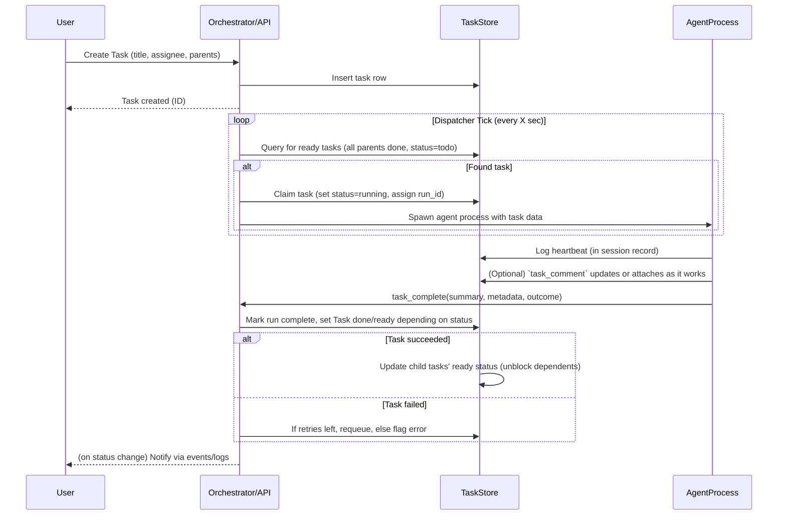

# Executive Summary  
We compare four state‑of‑the‑art AI multi-agent orchestrators – Multica, Gas City, Hermes Kanban, and Paperclip – to identify best features for a new system. Multica is a self‑hosted coding workspace that **assigns and tracks tasks via Git issues**, driving external agent CLIs (Codex, Claude, etc.) on user machines. Gas City is an orchestration **SDK/CLI** for durable “software factory” workflows, using *formulas* (TOML scripts) to fan out work across a fleet of agents and a durable *bead store* to persist tasks and dependencies. Hermes Kanban (by Nous Research) is a lightweight **SQLite‑backed Kanban board** integrated into the Hermes agent framework, providing durable tasks, handoffs, and retries across named agent “profiles”. Paperclip is a Node.js/React platform that treats agents as employees in an organization: it uses **org charts, budgets, schedules, and atomic task queues** to align multi‑agent work with company goals. We analyze each tool’s architecture and workflows (prompt intake, routing, execution, handoff) and extract standout features. Our recommendation fuses these into a unified design: a web UI + CLI + API surface; a durable dispatcher/worker system with task graphs (DAGs), retries, and checkpoints; a persistent “board” or database of tasks (akin to beads) with metadata; context propagation via summaries/links; and organizational policies (roles/budgets, as in Paperclip). Key features (task gating, dependencies, handoff metadata, schemas) are prioritized with references to the original projects. Finally, we outline an implementation plan: components (UI, dispatcher, storage, memory, artifact sharing), data models, APIs, flow semantics (via Mermaid diagrams), storage/memory options (BeadStore/Dolt, Mnemosyne, Waggle), and a development roadmap with effort estimates and risks.  

## System Overviews  

### Multica (AI Coding Agent Workspace)  
- **Architecture:** Multica consists of a Go backend with PostgreSQL and WebSockets, a Next.js/Electron front-end (web/desktop/mobile), and a local *agent daemon* that spawns external agent CLIs (Codex, Claude, Cursor, etc.). Clients (users and agents) connect via Web UIs, desktop apps, or a CLI; all surfaces talk to the same API.  
- **Workflow:** Users create or assign coding tasks as Git issues or tickets. Agents “show up on the board” as named team members. When an issue is assigned to an agent, the local daemon spawns that agent CLI on the user’s machine (“their desk is your machine”). The agent works on the code (using user‑provided context like linked repos/docs) and *comments to the issue* as it goes. On completion (success or fail), it opens a PR or attaches results back to the issue. Every step (tool call, diff, error, etc.) is **logged** with timestamps for audit. Failed runs can **auto‑retry** or stop for human review.  
- **Prompting & Input:** Work intake is typically via Git issues/projects or chat commands. The Multica CLI and API allow scripting; e.g. you can trigger agents via mentions or “start work without filing anything”. Agents themselves can call the same Multica CLI they drive (the “Multica CLI skill”) to get tasks or report results, treating the system’s CLI like a tool.  
- **Context Management:** Multica ties each task to its issue, keeping the **full conversation and execution log** in one place. The workspace shows which agent did what and how much it cost. Agents have no shared memory beyond this; each run is standalone but human approvers can see past runs. Dependencies come from Git: an issue completes when its PR is merged.  
- **Coordination & Routing:** Multica is mostly *one agent per task*. The “board” shows open tasks and which agent (profile) is working on them. Teams (“squads”) and roles can route tasks: a human leader picks tasks into queues (projects) that agents can claim. It supports scheduling (Autopilots for recurring standups/reports) and chat triggers. The system ensures *review gates* (work lands in review, not main branch, until human sign‑off).  
- **Tools for Agents:** Agents run as CLI processes on the host. They rely on git, code execution, etc., and report back via Multica’s API/CLI. Multica integrates ~26 agent CLIs natively (e.g. `claude`, `codex`, `cursor-agent`, `openclaw`, `hermes`, etc.). It also provides a conversation/chat frontend: the “Chat” feature lets you ask the workspace questions or give tasks without filing an issue.  
- **Unique Features:** Full **execution logs** and analytics (run history, costs) tied to issues; **human-in‑loop steering** (you can reply to a running agent and it continues under that context); integrated Git provider support (GitHub, GitLab, etc.) and chat (Slack, Telegram, etc.); workspace-level teams, roles, and scopes (who can run which agent). Tasks are tied to Git context, so Multica is ideal for coding/merge workflows.  

### Gas City (Software Factory Platform)  
- **Architecture:** Gas City is a Go‑based CLI (“gc”) and library that implements a **declarative orchestration engine**. Configuration is written in TOML packs, and state is stored durably (using [Dolt](https://dolt.com) for a versioned SQL store). The core components are: a **bead store** (a durable database of “work items”), an **orchestrator** loop, and an **event bus**. It includes an optional HTTP API and Web UI (via Mintlify docs), but primarily it’s CLI-driven.  
- **Primitives:** Gas City builds on six primitives:  
  - **Pack** – a config bundle (the *city*) that declares Agents, Formulas, and Orders.  
  - **Agent** – a configured worker (prompt, LLM, provider) – e.g. a Claude agent or OpenAI model, defined in TOML.  
  - **Formula** – a reusable procedure (TOML file) defining a multi-step job and dependencies (a workflow graph).  
  - **Bead** – a *unit of work* that survives crashes: tasks, sessions, mail, convoys, etc., all share the same DB table (beads have ID, status, type, fields). Dependencies between beads are represented by “needs” edges – a bead remains blocked until its parent beads close.  
  - **Rig** – an external project (git repo) with its own bead namespace and agent context; you register a rig (e.g. `gc rig add .`) to tie beads to a codebase.  
  - **Order** – triggers that automatically fire formulas on schedules, events, or conditions. Gas City’s “health patrol” process continually evaluates orders (cron, conditions) to spawn runs.  
  - **Event** – notifications emitted on state changes (to which humans or agents can subscribe).  
- **Workflow:** You write a *Formula* (TOML) once, then invoke it (via `gc sling`) on a convoy of beads (e.g. a feature or release). Gas City **materializes the workflow into beads**: each step becomes a bead with dependencies according to the formula graph. The orchestrator then *fans out* ready beads in parallel to agents. Each agent runs as a live session (e.g. an LLM process) and claims beads to work on. When a bead is completed (via `gc complete`), its status flips, unblocking dependents. If agents die, beads remain and new agents pick them up, since work lives in beads. Failed beads retry automatically by default.  
- **Prompting & Input:** Gas City tasks are created via the CLI or APIs (e.g. `bd create "Hello World"` creates a bead). Agents typically poll for beads or get notified via the event bus. There is no built-in conversational prompt interface; instead, workflows are scripted. (However, there *are* skills and packs for Gas City to integrate with LLM sessions.)  
- **Context Management:** All context is captured in beads and the shared database. The Formula file and Pack define the context and prompt templates. Once a workflow is launched, the formula text itself isn’t needed again – the graph lives in beads. Agents can pass summaries/results via bead metadata. The *Session* bead records an agent’s live run, and tasks can carry metadata (similar to Hermes Kanban’s run summaries). The system is durable: restarting the orchestrator or hosts resumes unfinished beads.  
- **Coordination & Routing:** Gas City is *role‑agnostic*: no hardcoded “manager” or “reviewer” roles; all roles come from configuration. Agents belong to queues (often one queue per formula or role). The orchestrator loop does multi‑phase dispatch (reclaim stale claims, detect crashed sessions, promote unblocked beads, spawn new sessions). Dependencies enforce order, and a global event bus provides visibility. You can scale an Agent type into a pool; Gas City will check how many active sessions are needed (up to `max_active_sessions`) by running a scale‑check query.  
- **Tools for Agents:** The CLI provides commands like `gc session`, `gc bead`, `gc sling`, etc. Agents can also use libraries: for instance, there is an OpenAI/GPT provider, and a “session attach” to join a run interactively. The system ships packs (e.g. “GitOps” pack) which include agent prompts, formulas, and transforms. Agents can do text/JSON tool calls as usual LLM clients, but Gas City handles persistence and routing.  
- **Unique Features:** The *bead model* itself is unique: a single schema holds tasks, mail, convoys, with first‑class **dependencies** (blockers). Formulas are *declarative* code: engineers write TOML, not glue code. The system is built for **durability and scale**: even massive workflows (dozens of steps) run without user oversight. Gas City also supports batch dispatch and patterned pipelines (via “Convoy” beads for parallel jobs). It can run on a cluster (there are Kubernetes modes) or single machine, and its architecture cleanly separates config (packs) from runtime.  

### Hermes Kanban (Nous Research Agent Board)  
- **Architecture:** Hermes Kanban is part of the Python‑based Hermes Agent framework. It runs as a component of the Hermes **gateway/dispatcher** (the bot server). Core pieces are (1) a SQLite DB (`~/.hermes/kanban.db`) storing *tasks, events, runs, comments*, and (2) a dispatcher loop in the gateway that **ticks periodically** to manage the board. Each Hermes *agent profile* on a machine becomes a worker process that can claim tasks. The same DB is shared by all profiles. A CLI (`hermes kanban …`) and a web dashboard present the board to humans; agents interact via built‑in *kanban tools* (Python APIs).  
- **Workflow:** Tasks appear as Kanban cards (rows in the DB). Agents call APIs like `kanban_create`, `kanban_complete`, `kanban_request_review`, etc. to mutate tasks. The dispatcher cycle does: (a) **reclaim stale claims** (if a worker died), (b) **promote dependencies** (move tasks from “todo” to “ready” once parents are done), (c) **spawn workers** (start new agent processes for ready tasks), and (d) handle blocked or crashed runs. Each **attempt** to complete a task is a separate *run* (recorded in `task_runs`), capped at 3 by default. This yields a full run history per task (for audit).  
- **Prompting & Input:** The main “prompt” to Hermes Kanban is a human or orchestrator creating a task (with optional parents/links) via CLI, dashboard, or conversation. Once on the board, tasks can be distributed by assigning to agent profiles, or simply pulled by any worker when ready. Agents themselves, during their runs, use the **`kanban_*` toolset** to check the board and advance their task. For example, an agent can call `kanban_show`, `kanban_list`, or even open new child tasks via `kanban_link`. Handoffs (task completions) happen when a worker calls `kanban_complete(summary, metadata…)`, which closes its run.  
- **Context & Handoff:** Hermes Kanban explicitly propagates context: when a worker completes a task, it provides a *summary* (human‑readable) and *metadata* (JSON) that are saved on that run. Any downstream child tasks can read the latest parent summaries to inform their work. The Kanban enforces a “completion contract” for PRs (binding a pull request to a card) and ensures dependencies must be satisfied (you *cannot* complete a child if a parent is not “done”). Context from failures is also captured: if a run crashes or is reclaimed, the outcome is logged, and retries (up to the limit) can be attempted. The dispatcher’s checkpoint ensures no progress is lost on restart.  
- **Coordination:** Agents and humans use the board as a **shared durable queue**. Multiple workers can pull from the same “ready” list in parallel (true concurrency), each having its own OS process. The system avoids race conditions via a live “claim” lock: only the claiming worker (or a force command) can complete its task. There is no built‑in hierarchy; any agent with access can work on tasks. Collaboration patterns (research teams, review pipelines, fleet management) are achieved by linking tasks and using Kanban statuses (todo, ready, running, review, blocked, etc.). Unlike a synchronous `delegate_task` call, Kanban tasks are **peer‑queued**.  
- **Tools for Agents:** Hermes Kanban provides a suite of command‐like tools that an agent can use **directly in its Python loop**. These include: `kanban_show`, `kanban_list`, `kanban_complete`, `kanban_request_review`, `kanban_block`, `kanban_heartbeat` (refresh worker), `kanban_comment`, `kanban_attach`, `kanban_create`, `kanban_link` (add dependency), etc. The agent’s dispatcher profile is launched with these tools pre‑loaded. Internally, these call into the same DB layer as the CLI. For humans, equivalent actions exist via `hermes kanban ...` commands or the dashboard.  
- **Unique Features:** Hermes Kanban is extremely lightweight yet powerful. Its design prioritizes **durability and traceability**: every task change is an event in SQLite, with no hidden state. It offers *session heartbeats*, *review gating*, *iterative budget warnings*, and even *circuit-breakers* for failed tasks. It fully supports multi‑profile (multi‑GitHub identity) use, message forwarding, and live WebSocket updates. Key semantics: tasks can carry PR merge contracts (complete when a CI‑passing PR is merged); tasks are divided into runs for audit; dependency edges enforce workflow order. In short, it excels at **robust pipelines and handoffs**: it brings server‑grade guarantees (retries, history, crash safety) to multi-agent tasks.  

### Paperclip (Agentic Organization Manager)  
- **Architecture:** Paperclip is a Node.js/TypeScript backend with a React/Next.js UI. Data is stored in (likely) a SQL/TS backend (e.g. Postgres) and/or NoSQL; the public repo suggests an Express-like server (`server/`) and agent management (`tools/agent-shim`). There are official mobile clients (Expo React Native). It emphasizes a *GitOps‑style* setup (e.g. an example `test-drive` CLI creates a Git worktree and launches tasks). Core subsystems (as per Starlog analysis) are: a **hierarchical context manager** (organization chart), an **atomic task scheduler**, and **heartbeat scheduling**.  
- **Organization Model:** Uniquely, Paperclip models an **org chart** as the data backbone. You create Companies and Roles (CEO, Manager, Developer, etc.) with reporting lines, each role bound to a specific agent model and budgets. For example, a CEO agent (GPT-4) and a pool of developer agents (Cursor) can be defined. Context flows along this hierarchy: goals and directives given to a manager propagate down to task descriptions, and blockers encountered at lower levels escalate up with their context intact. Roles also carry *budgets* (per-month, per-task limits) to control API spend.  
- **Workflow:** Tasks are treated as **tickets** (issues) tied to company, project, and goal. Any agent or human can create a Task and assign it to a Role or Person. Agents acquire work through **heartbeat polling** or assignments: every agent instance periodically checks (“heartbeat”) for new tasks or scheduled routines. Paperclip enforces **atomic task checkout**: each task can only be checked out by one agent at a time, with locks and budget validation. Once an agent checks out a task, it works on it (calling tools or chain of actions). When done, it calls `complete()`, passing outcome, cost, and artifacts (e.g. “pull-request-url”). If it fails, it can `escalate()` the task to its manager or next role, including a reason. All decisions are **immutably logged**.  
- **Prompting & Input:** Paperclip’s front end allows creating tasks, setting goals, and defining routines (scheduled tasks). Agents also interoperate: for example, an agent could be written to respond to mentions in Paperclip’s chat, but the primary mode is via the agent SDK. The backend exposes an SDK or REST API: e.g. the Starlog example shows code like `await agent.checkoutNextTask(...)`. Agents thus call these APIs to get work and report results. There are also “adapter plugins” so external bots (via MCP protocol) can connect.  
- **Context Management:** Context is hierarchical. When a high‑level goal is set (CEO decides “we build X”), it becomes linked to projects and tasks. Agents see the entire goal chain, not just the immediate task name. Task descriptions can include linked documents or screenshots. All chat, comments, and code reviews are **threaded on the task**. Paperclip maintains each task’s full lifecycle: current status, assignee, blockers, comments, attachments, diff previews, etc., all in the database. This ensures context flows with the work and is retained across runs.  
- **Coordination & Routing:** Agents are essentially *employees* who either pick tasks or receive tasks from human managers. The org chart and **review stages** govern who can create or approve tasks. For example, a developer agent must have its code PR approved by a QA agent/bot before merge. Paperclip allows defining gated workflows (e.g. “after work, a review bot must approve before completion”). Heartbeats let agents participate autonomously 24/7; agents escalate issues up the chain as needed. Routines (cron/webhook triggers) generate tasks automatically on schedule.  
- **Tools for Agents:** Paperclip provides an **agent SDK**. The Starlog article shows pseudo-code: `agent.checkoutNextTask({...})` to get work, `await agent.execute(task)`, then `task.complete({...})` or `task.escalate({...})`. These calls are atomic and integrated with cost/budget checks. There’s also a “private MCP server” feature (MCP = Model Control Proxy) for bots to connect. The UI/CLI supports messaging: e.g. agents can be pinged via Slack/Discord, and Paperclip can email agents or let users chat with agents within tasks.  
- **Unique Features:** Paperclip’s **org-as-data** approach is its key differentiator. Rather than ad-hoc graphs, it enforces structure: roles, budgets, permissions are first-class. It tracks budgets/costs at every level (company, project, agent, model) and can throttle or stop work when limits are hit. The *“Skills Studio”* lets teams define shared skills and automated tests for agents (pillars). It supports multiple organizations per instance (tenancy) and a mobile app for on-the-go management. Importantly, it guarantees no duplicate work via atomic locks, and any partial session restarts can resume on the same task. The entire system is essentially “running a company of AI agents” with governance and audit built in.

## Comparative Analysis  

Below we compare core features and patterns:

| Feature / Pattern            | Multica                                   | Gas City                                 | Hermes Kanban                         | Paperclip                             |
|------------------------------|-------------------------------------------|------------------------------------------|---------------------------------------|---------------------------------------|
| **Primary Use Case**         | Coding tasks via Git issues; CI pipelines | Declarative software pipelines across repos | Durable multi-agent Kanban workflows (research, ops, review pipelines) | Company-scale autonomous org (task mgmt, budgets, org charts) |
| **Deployment**               | Self-host or desktop app + server         | CLI/SDK; can run on laptop or server (uses Dolt)| Python agent/gateway (Hermes) on user PC or server (stores SQLite locally) | Node.js backend + React UI (server or cloud); supports multi-org deployments |
| **Task Definition**          | Git issue → assigned task                 | Formula (TOML) generates beads (units) | Kanban card in DB (with fields like title, assignee, parents) | Work tickets/issues with company/project links; can chain via “parent” fields |
| **Scheduling & Triggers**    | Manual assign; automated standups (Autopilots) | Orders (cron, events) launch formulas | Agents poll DB; human slash/CLI commands; no built‑in cron (use external crons to open tasks) | Heartbeat polling; **Routines** run recurring tasks (cron/webhook) |
| **Task Routing**             | Assigned to specific agent or “leader”    | Agents defined in pack; any agent can pick ready beads matching its capabilities; sessions auto-scaled | Workers pull from ready queue; dispatcher assigns by locking a task upon spawn | By org-role: agents inherit tasks from parent’s assignments; CEO→Manager→Developer flows tasks downward. Atomic checkout ensures one agent per task. |
| **Dependencies**             | None (Git branch order)                   | Formula steps depend on others; beads have explicit “needs” edges | Direct parent-child links block until parent done | Tasks have blocker dependencies; tasks linked to goals and projects form a tree. Multi-stage reviews (approval gates). |
| **Durability**               | Database-backed; runs persisted in DB     | Durable bead store (Dolt SQL); crash-safe | Durable SQLite; dispatcher recovers tasks on crash | Durable DB; tasks, audit log, versions all saved; agent sessions may restart and resume existing tasks (via agent-shim) |
| **Context Propagation**      | Encoded via Git issues, PRs, and comments | Formula/pack import context; beads carry data; no global memory beyond config | Summary/metadata on runs passed to downstream tasks | Hierarchical: company-level goals flow into tasks; escalations flow up preserving context. Tasks link to projects/goals for background info. |
| **Agent Identity/Memory**    | Agents have fixed CLI identity but stateless between tasks (no built-in memory) | Agents defined in config, no memory persistence beyond bead states (can add custom “memory” tasks) | Each Kanban profile is a named agent; they have separate session DBs/memory, but Kanban itself has no LLM memory (only transcripts) | Agents have personas tied to roles; no intrinsic memory beyond tasks, but can integrate “skills” (scripts/tests). |
| **Handoff/Reporting**        | Agents post results as PRs or comments; humans review | Completed beads can emit events; multi-agent gap-check handles reviews | Agents use `kanban_complete(summary, metadata…)` to hand off work. Human CLI can also mark done with summary. All attempts logged. | Agents call `task.complete(outcome, cost, artifacts…)`. Logs of all actions kept. Human reviews via multi-stage approvals. |
| **Retries & Errors**         | Failed runs can retry or escalate; logged in execution log | Orchestrator retries failed beads by default; can escalate via formula logic | Bounded retries (default 3 attempts); dispatcher will respawn crashed tasks. Circuit-breaker stops repeated failures. | Agent catches exceptions and calls `task.escalate()`. Automated retries possible if error not fatal. Budget limits can pause work automatically. |
| **Agent Tooling/API**        | Agents run local CLIs; Multica CLI is both user and agent API | `gc` CLI and API (Go library); agents mostly use LLM APIs directly (with pack prompts) | `kanban_*` tools inside Hermes agent loop; CLI (`hermes kanban`) for humans. Agents use these to see/modify board. | Agent SDK (JS/TS): `checkoutNextTask()`, `execute()`, `complete()`, `escalate()` calls. Also REST APIs and webhooks. |
| **Unique Strengths**         | Best for *code-centric* tasks (code generation, repos). Great Git/chat integration and per‑run cost analytics. | Ideal for *structured, repeatable pipelines*. Extraordinary durability (no single session can lose progress). Declarative workflows. | *Lightweight multi-agent board*: durability & audit with minimal infra. Parallel research/review workflows with gating. Good for non-Git tasks. | *Company‑wide autonomy*: roles, budgets, governance. Scales from single to many teams. Full organizational context and cost control. Mobile & multi-tenant ready. |

Hermes Kanban shines in **task handoff and dependency**: its run-based model attaches summaries/metadata to tasks so children get rich context, and it enforces *no-child-complete-unless-parent-done* rules. Paperclip excels at **hierarchical routing and atomic tasks**: each task checkout is one agent only (preventing duplication) with built‑in budget checks. Gas City’s novelty is in **durable “beads”** and declarative formulas, giving a database-centric approach. Multica’s strength is blending **standard dev workflows** (issues, PRs) with AI agents and having a full audit trail in a team environment. A fused system should combine these: for example, use GasCity/Hermes‑style durable task records plus Multica/Paperclip org context and review gates.

## Priority Feature List with References  

Below is a prioritized feature list for the new orchestrator, mapping each to the project(s) that exemplify it and justifying why it’s needed:

| Feature                            | Reference System(s)      | Why and How to Use                                                         |
|------------------------------------|-------------------------|---------------------------------------------------------------------------|
| **Durable Task Store (Beads/DB)**  | Gas City, Hermes | A centralized, durable database of tasks (“beads”/cards) ensures crash safety and audit. We should adopt a DB (SQLite or Dolt) that persists all tasks, events, and run history, so work can resume after any failure. |
| **Dependency DAG Semantics**       | Gas City, Hermes  | Support explicit task dependencies: a child task shouldn’t start until all parent tasks are done. Use a DAG model (as in Gas City’s formula beads or Hermes’s `needs` links) to express workflows. This prevents race conditions and encodes pipelines. |
| **Agent Profiles & Org Roles**     | Paperclip, Multica | Maintain named agent identities and organizational structure. Like Paperclip’s org chart (roles with managers, budgets), agents should belong to profiles with specific capabilities and possibly reporting lines. This allows goal propagation and governance. |
| **Atomic Task Checkout**           | Paperclip     | Ensure each task is executed by only one agent at a time. Implement an atomic claim/lock (via DB flag) on tasks, so multiple agents don’t duplicate work. This follows Paperclip’s model and avoids concurrency conflicts. |
| **Task Handoff Metadata (Summary)**| Hermes         | Allow agents to attach a summary and structured metadata when completing a task, which downstream tasks can read. Hermes’s `kanban_complete(summary, metadata)` is ideal: use it to propagate context (e.g. test results, diff lists). This makes multi-step tasks coherent. |
| **Retries and Timeouts**           | Multica, Hermes | Implement automatic retries with caps. If a worker fails or times out, the dispatcher should attempt it again (up to N times), and record each attempt in history. Like Multica and Hermes, log why it failed. |
| **Review & Approval Gates**        | Multica, Paperclip | Integrate human review steps: tasks should move to a “review” status requiring explicit approval before final completion. Multica pushes work to review; Paperclip has configurable review stages. This guards quality. |
| **Chat/CLI Interfaces**            | Multica, Hermes | Provide both human (UI/CLI) and agent (toolset) ways to interact. Like Hermes’s dual interface (CLI vs tools) and Multica’s chat commands, ensure tasks can be created/viewed via CLI, web UI, and also manipulated by agents via tools/APIs. |
| **Scheduling & Routines**          | Gas City, Paperclip | Support scheduled or event‑triggered tasks. Borrow Gas City’s **Orders** (cron triggers) to launch workflows, and Paperclip’s **Routines** (recurring tasks with history). Useful for periodic reports, maintenance tasks, etc. |
| **Observable Events/Audit Log**    | Gas City, Hermes | Emit events or logs for every state change (task claimed, completed, blocked, etc.). These can feed a dashboard/WS channel for live updates. Include which profile/agent made each change. |
| **Contextual Workspaces**          | Multica, Paperclip | Keep context with tasks: link tasks to repos/docs or goals. E.g. Multica attaches repos/projects as context, and Paperclip links tasks to goals/projects. Build a model where tasks belong to “projects” (rigs) with attached context docs. |
| **Artifact Sharing**               | Paperclip, Hermes‡ | Allow attaching files or URLs as task artifacts. Paperclip shows files/diffs; Hermes Kanban has `kanban_attach_url`. We should include an artifact storage or link mechanism (see Waggle for file sharing). |
| **Memory/Persistent Chat**         | None of above directly      | (Stretch) For richer AI context, a memory system like Mnemosyne or Ai‑memory could be integrated. E.g. allow agents to recall past task details. This is not fully addressed by these projects. Could mark low priority or optional. |

*References:* Projects shown in brackets. E.g. “Hermes” means Hermes docs cover that detail.

## Fused Architecture  

Our system will have several layers and components:

- **User Interfaces / Surface:**  
  - **Web UI (React/Next.js)**: A dashboard with boards, task creation forms, comment threads, file/PR attachments, org chart and settings pages. (Paperclip’s UI and Multica’s Next.js web app provide models.)  
  - **CLI & API**: A command-line client and REST API for scripting. All user actions (create task, list tasks, approve, etc.) should be doable via CLI. Also an **agent API/SDK** (like Paperclip’s JS SDK or Hermes tools) so LLM agents running in code can interact programmatically.  
  - **Chat/Slack Integration:** (Optional) Allow slash-commands or bots to open tasks or see status. Inspired by Multica’s chat triggers and Paperclip’s agent chat. Not core but beneficial.  

- **Dispatcher / Executor:**  
  - A central **orchestrator process** that runs a loop (or event‑driven handlers). It will (1) scan the task store for ready tasks, (2) claim tasks (lock them), (3) launch agent workers to handle them, (4) monitor heartbeats, (5) detect crashed or timed‑out tasks and retry or escalate, (6) enforce any gating (parents, budgets) before moving tasks to completion. This is a hybrid of Gas City’s orchestrator and Hermes’s Kanban dispatcher.  
  - **Workers:** Agents run as separate OS processes or containers. They could be actual LLM CLI processes (like Multica/Hermes style). Each worker loads a task context and executes it. When done, it calls back (via tool or CLI) to mark completion. We may reuse **agent daemons** like Multica’s local runtime or Paperclip’s agent-shim concept to launch LLMs.  
  - **Toolkits:** Provide built-in tools for tasks: e.g. `task_show`, `task_complete`, `task_comment`, `task_attach`, analogous to Hermes’s Kanban tools. Agents call these in-process to update the task DB.  

- **Persistent Storage:**  
  - **Task Database:** A SQL database (PostgreSQL or SQLite or Dolt) with tables for Tasks, TaskRuns, Events, Comments, Attachments, Sessions, etc. (Inspired by Hermes’s SQLite schema and Gas City’s bead schema.) Each Task has fields: `id, title, description, assignee, status, creator, created_at`, and pointers to parent tasks.  
  - **TaskRun Table:** Like Hermes, track each attempt: run_id, task_id, status (completed/failed), summary, metadata JSON, start/end timestamps.  
  - **Event Log:** Record all state changes (claim, complete, fail) with timestamps for auditing. Useful for dashboards.  
  - **Configuration Store:** For Org Chart, Agents, Formulas, Orders (if we include workflows). Could use JSON/TOML configs in Git or DB tables (like Paperclip or Gas City’s pack).  
  - **Artifact Storage:** A place to store or link files. Could be as simple as saving file paths on disk or using Waggle (peer file sharing). Each task can have 0+ attachments.

- **Memory & Context:**  
  - **Session Memory (optional):** Integrate a knowledge base (e.g. *Mnemosyne*, *ai-memory*) for reusable facts. Agents can query this if needed. Not all projects cover this, but it’s a suggested add-on.  
  - **Task Context:** Each task record should reference its project/goal and optionally carry pointers to external context (git repo URL, docs). Use the concept of “Rigs” or projects (Gas City/Rig or Multica/Project) to scope tasks.  

- **APIs and Data Model:**  
  - **REST/WebSocket API**: For UI and CLI to manipulate tasks, agents, etc. Endpoints like `/tasks`, `/agents`, `/sessions`, `/orgchart`.  
  - **Agent API/SDK**: Expose programmatic calls (checkout, complete, comment) to agents. Could be WebSockets or local IPC. Paperclip shows e.g. `agent.checkoutNextTask()` in code; we can design similar async functions.  
  - **DAG Semantics:** Tasks have `needs` edges in DB. Dispatcher only moves tasks to “ready” when all parents are done (like Hermes’s promotion and Gas City’s needs). Attempts/locks ensure one agent per task (atomic).  

- **Workflows & Sequencing:**  



This shows the core loop: **user creates tasks (prompt intake)**, the **dispatcher routes to agents (via claims/spawns)**, the **agent executes and hands off (task_complete)**, and the orchestrator then **unblocks or retries** as needed.

- **Handoff & Completion:** Agents complete tasks by calling an API (or using a provided library). They must provide at least a textual summary, and can include structured results (e.g. changed files, test outcomes) as metadata. On completion, the task record and run history are updated; dependent tasks become visible. If a human reviewer or another gate is configured (like requiring QA approval), the task may transition to a “review” status instead of done. For PR‐type tasks, we can tie completion to external status (as Hermes does).  

- **Context Capture:** All agent outputs (logs, code changes) should be captured. We will log every tool call and even allow “steering”: if a human replies during a run, it’s appended to the current run transcript (as in Multica). For AI memory, we might periodically snapshot relevant facts to a long-term store.

- **Observability:** The system should emit events for UI/WS streams (like Hermes’s Kanban events). A WebSocket channel can update the UI drawer live when runs finish. All retry counts, durations, and failures should be logged. Metrics (tasks per day, cost, latency) help on-call debugging.

- **Security:** Support user roles (admin, manager, member). Follow Paperclip’s model: **permission scopes** on who can create/assign tasks or run which agents. API tokens and OAuth for Git/chat integrations. Use the same agent‐level isolation as Hermes (each agent runs on its own machine, its own credentials). Consider namespacing in multi-tenant setups.

- **Scaling:** The dispatcher can run multiple threads or be sharded. Gas City shows you can multiplex “packs” or even cluster the DB with Dolt’s sync. For large scale, use a robust DB (Postgres/Dolt) and maybe RabbitMQ for events. The agent pool can be elastically sized (like Gas City’s scale_check). We recommend containers or Kubernetes for deployment for easy scaling.

- **Storage and Memory Systems:**  
  - *Task Store:* We can use **BeadStore (Dolt)** like Gas City, since it natively supports SQL queries and branching (good for reviews). Alternatively PostgreSQL with JSONB. Dolt has built‑in persistence guarantees.  
  - *Memory:* Integrate something like **Mnemosyne** or **ai-memory** for agent “recall”. E.g. when an agent asks for relevant facts about a user or previous tasks, query memory. Not covered in depth by these projects, but valuable for agents to not “forget” earlier context.  
  - *Artifacts:* Use **Waggle** (open-source file sharing) or a cloud bucket. Tasks that produce files or screenshots should be uploaded and URL‑attached to the task. (Hermes Kanban supports `kanban_attach_url`.)  
  - *State Storage:* Ensure all agent state (task runs, sessions) goes to DB, not in RAM, to enable crash recovery (like Hermes’s SQLite with WAL mode).  
  - *Cache:* For performance, task metadata could be cached in memory and flushed to DB on events.

- **Code Modules to Study:** Key reference code in each repo:  
  - **Multica:** Look at `server/handler` and `packages/agent-daemon` for agent orchestration logic; `packages/cli` for command handling; `docs/core-concepts`.  
  - **GasCity:** Study `cmd/gc/` (main CLI and dispatch code), `internal/beads/` (bead store impl), `internal/runtime/` (agent session management), and `internal/config/pack.go` (configuration handling). The “gc sling” command shows how tasks are launched.  
  - **Hermes:** The `hermes-agent` code (not open here, but see docs) – focus on the `kanban_db` Python module and the dispatcher loop (`gateway/dispatch.py`). The Magnus blog details internals (transactions, runs).   
  - **Paperclip:** Inspect `server/` (Express APIs), especially the agent-related endpoints; `tools/agent-shim/` for how agents connect; and the `docs` folder for schema. The Starlog article pseudocode hints at internal functions like `checkoutNextTask` and `task.complete`.

## Workflow Diagrams (Mermaid)  

```mermaid
flowchart LR
    U(User) -->|1. Create/assign task| API((API/UI))
    API -->|2. Insert task row| TaskDB[(Task DB)]
    TaskDB -->|3. Dispatcher sees ready task| Dispatcher
    Dispatcher -->|4. Claim + spawn worker| Worker[Agent Process]
    Worker -->|5. Work on task, logs updates| TaskDB
    Worker -->|6. Complete/metadata| API
    API -->|7. Update run history| TaskDB
    TaskDB -->|8. Release child tasks| Dispatcher
    Dispatcher -->|9. (maybe) Spawn more| Worker
    API -->|10. Notify user/dashboard| U
```

**Legend:** (1) A user or cron creates a task via API/CLI. (2) It’s stored in the database. (3) The dispatcher loop finds the task ready (no open parents) and claims it. (4) It starts an agent worker process. (5) The agent does work, posting interim comments. (6) On finish, it calls the API to complete the task with summary. (7) The DB logs this run. (8) Any dependent tasks are now unblocked. (9) The dispatcher may spawn new workers for those. (10) The UI/user is notified of updates (via WebSocket or CLI query). This cycle continues until all tasks are done.  

## Component Specification  

- **Data Models:**  
  - *Task:* `{id, title, desc, assignee, creator, status, parents[], child_tasks[], created_at, updated_at}`. `status` ∈ {todo, ready, running, blocked, review, done}.  
  - *TaskRun:* `{id, task_id, attempt_no, outcome, summary, metadata(JSON), started_at, ended_at}`. Link to `task_id`, holds run-specific results.  
  - *AgentProfile:* `{id, name, provider, role, capacity, scale_params, credentials}`. Defines agents like Gas City packs or Paperclip roles.  
  - *Organization/Role:* (if implementing Paperclip style) `{company, hierarchy tree with roles, budgets, manager_id}`.  
  - *Session:* `{id, agent_id, task_id, status, last_heartbeat}` (optionally track live sessions).  
  - *Attachment/Event:* Tables for attached URLs/files and logged events.  

- **APIs:**  
  - **Tasks:** CRUD (`GET /tasks`, `POST /tasks`, `PATCH /tasks/:id` with summary/metadata to complete). Use REST or GraphQL. Include filters (by status, assignee).  
  - **Agent Actions:** e.g. `POST /agents/:id/checkout` returns next task, `POST /agents/:id/complete` for finishing, `POST /agents/:id/escalate` to escalate task (Paperclip style). Or a generic `/work/checkoutNextTask`.  
  - **Org Chart:** APIs for adding/removing roles, setting budgets, reporting lines (Paperclip’s model). E.g. `POST /roles`.  
  - **Sessions:** WebSocket endpoints for agent heartbeat and receiving notifications, similar to Hermes’s notify/wake.  
  - **Events:** Possibly `/events` for clients to subscribe (WebSockets or SSE), using the DB’s event log.  

- **Task DAG Semantics:**  
  Implement the following logic: when creating a task, allow specifying parent IDs (`task.parents`). The system should verify parents exist. A task remains `blocked` until all its parents have `status == done`. The dispatcher periodically scans for tasks where all parents are done and status is not blocked, and sets them to `ready` (like Hermes’s “promote” step). If a parent reopens, we could force child rollback or warn the user (as Hermes does).  

- **Retry and Backoff:**  
  Each task has a retry count. On worker crash or timeout, mark run as `failed` and increment attempt. If attempts < max, requeue (with optional backoff delay). If exceeding attempts, mark `gave_up` or escalate to human review. Log each run’s error message. Avoid tight infinite loops by capping retries and maybe exponential backoff.  

- **Long‑running Workflows:**  
  For very long or multi‑step processes, support saving intermediate state. For example, like Gas City’s “convoy” beads or Hermes’s runs: each step’s output can feed next step. We allow tasks to spawn child tasks (via API), forming sub-DAGs. This covers pipelines like “Spec -> Implementation -> Review -> Merge”.  

- **Context Capture:**  
  Provide a way for agents to “summarize” their environment: e.g. saving transcripts of conversation. Could record agent’s prompt + response logs in `TaskRun.metadata`. Use memory (if implemented) to snapshot important info.  

- **Agent Routing/Delegation:**  
  Incorporate **org roles**: tasks can be assigned to roles, and the system picks an available agent in that role to execute. For delegation, allow an agent to create a new task and assign it to another agent/role (like Hermes’s `kanban_link` or Paperclip’s escalate).  

- **Handoff Protocols:**  
  Define structured handoff: each complete call may include `artifacts` (links to produced output like PRs or docs). A task can have attached file (like Hermes’s `kanban_attach_url`). For code tasks, tasks might link to a feature branch/PR.  

- **Observability & Monitoring:**  
  Build logs of all actions (DB events) and surface them in an “Activity Stream” UI. Expose metrics endpoints (task throughput, error rates). Use the event log for a live dashboard (like Hermes’s live drawer refresh).  

- **Security:**  
  Implement user authentication and per-role permissions. Agents run on user credentials or a service account, with limited scopes (e.g. Git/Slack tokens). Secure channels for agent-server comms. Possibly reuse Paperclip’s approach: each agent checks out tasks only within its allowed scope.  

- **Scaling Out:**  
  Use a robust DB (e.g. PostgreSQL) for multi-host deployments, or Dolt for easy replication. Containerize the orchestrator; use Kubernetes or systemd for the dispatcher. Allow multiple dispatcher instances (leader election on DB lock) for HA. Agents can run on any connected host (via a lightweight daemon, like Multica’s).  

## Implementation Plan  

### Phase 1: Core Task Engine (Low Effort, Risk Low)  
- Set up a **database schema** for Tasks, Runs, Events, etc. (based on Hermes Kanban/GasCity).  
- Implement a **basic API server** with endpoints to create tasks and list tasks. Provide a simple CLI to call these.  
- Build the **dispatcher loop**: claim “todo” tasks, update status. Initially just mark tasks done by API call (no agent process).  
- **Workflow:** Test by creating tasks with parent links and ensure child tasks only move ready when parents complete (DAG semantics).  
- Add **retries** and run history logs.  

### Phase 2: Agent Integration & Tools (Med Effort, Risk Medium)  
- Define an **agent profile model** and a way to register agent executors (like Docker image or LLM client).  
- Provide an **agent daemon** (Python or Go) that can poll the API, lock/checkout tasks (atomic), execute them (e.g. by calling OpenAI API), and call back `complete`/`escalate`. Follow Paperclip’s pattern.  
- Implement **agent tools** (CLI or library) that call into API: `task_show`, `task_complete(summary, metadata)`, etc. Copy Hermes’s approach of in-loop tool calls.  
- **Execution Log:** Record all agent outputs and actions in the database for audit (like Multica’s logs).  
- **State Persistence:** Ensure agent sessions can resume: e.g. store last checkpoint.  

### Phase 3: UI, Reviews, Policies (Med/High Effort)  
- Build the **web dashboard**: Kanban-style board view (columns for statuses), task detail panel, comment threads, file attachments. Use React/Next.js.  
- Add **review gates**: allow configuring that a task (or task type) requires a human “approve” action before final completion (like pull request reviews).  
- Implement **role/org chart** features: admin UI to define roles and link agents/users. Display who reports to whom. Link tasks to goals/projects. This is heavier (Paperclip’s main innovation).  
- **Notifications**: Slack/email alerts on task assignments, completions.  

### Phase 4: Advanced Orchestration (High Effort, Risk)  
- **Formula packs (Optional):** Allow user to define multi-step workflows (TOML formulas) that auto-launch tasks (like Gas City). Integrate a pack loader and “sling” command.  
- **Bead-like store:** If using Dolt, implement migration and branching for tasks (harder).  
- **Memory integration:** Hook an LLM memory module.  
- **Budget/cost controls:** Implement task limits and spend tracking per agent/project (from Paperclip).  
- **Waggle artifact store:** For file sharing between agents.  

**Milestones & Rough Effort:**  
1. **Database+API skeleton** – Low. (Foundation, straightforward.)  
2. **Dispatcher + basic CLI/DB** – Med. (Write the event loop, claim logic.)  
3. **Agent worker + tools** – Med. (Design protocol, ensure atomic checkout.)  
4. **Web UI & CLI frontend** – Med. (Kanban UI, commands, UX polish.)  
5. **Org roles & policies** – High. (Paperclip‐style RBAC and budgets.)  
6. **Formulas/pack system** – High. (Adds complexity but reuses patterns from Gas City.)  
7. **Scalability & HA** – Med. (DB tuning, multiple dispatchers, error handling.)  

**Key Risks:** Ensuring durability and concurrency safety is critical. Testing crash/recovery paths (like Hermes) is a must. The budget/org features are complex. Adoption of Dolt is optional but introduces build complexity. Dependencies logic must avoid deadlocks. Clear monitoring must be built early to diagnose issues.  

**Storage Recommendations:** Use **Dolt** (as Gas City does) for the task database to get branching and easy backups, or PostgreSQL with JSON for flexibility. For memory, consider integrating **Mnemosyne** or a vector DB if needed. For artifacts, Waggle or an S3 bucket.

**Code Study Tips:** Focus on the modules listed above. For example, in Gas City’s code, examine `internal/beads/store.go` and `cmd/gc/dispatch.go`. In Hermes, find `kanban_db.py` and the dispatcher threads. In Paperclip, explore `server/models/task.ts` or similar, and `tools/agent-shim/index.js`. These will reveal patterns for data handling and agent protocols.

---

*Sources:* Multica repo/docs; Gas City repo/docs; Hermes Kanban docs; Magnus Hedemark blog on Hermes; Paperclip README and analysis. These provide the above details and comparative insights.